# Java入门及背景

## 计算机语言发展历史以及未来方向

### 计算机已经成为人脑的延伸

1. 计算机已经成为我们这个时代的核心设备，每时每刻都需要它的存在，计算机也不再是大家以前的印象中的台式机，服务器，已经演变成我们身边随处可见的物体。比如：手机，平板电脑，笔记本，以及很多人没有意识到，但实际上设备内部包含的“计算机”的设备，比如电视机，微波炉，汽车，甚至小孩子的智能机器人等等。
2. 可以这么说，计算机已经成为人类身边的延伸，大脑的延伸，成为不可或缺的一部分，未来，计算机将真的进入人的身体，进入大脑，真正成为人体的一部分。比如，在科幻电影中<黑客帝国>中，主角被超级针头插在颈部后方，便能使他快速学习，改变大脑神经网络，几秒成为功夫高手。
3. 算法是计算机的灵魂，编程语言是塑造计算机灵魂的工具。
4. 计算机是如何运作的？对于普通人来说，这很神秘，让计算机拥有灵魂，可以按照人的意志运行，甚至某天按照计算机自己的意志运行。计算机的核心就是算法。算法就是计算机的灵魂，算法的实现由依赖于计算机编程语言。
5. 计算机编程语言的发展，是随这计算机的硬件而发展起来的。硬件速度快，体积小，成本越低，应用到人类社会的场景就越多，那么所需要的的算法就会越复杂，也就要求计算机编程语言越高级。
6. 最初重大几十吨但一秒钟只可以运行5000次的ENIAC(世界上第一台计算机)，只能做非常小的应用。比如某一些情况下，弹道的计算，现在任何一个人的手机运算能力都可以秒杀那个年代地球上所有计算机运算能力的综合。
7. 
8. 
9. 计算机编程语言的发展经历了从低级到高级发展，发展核心思想就是"让人更容易编程"，越容易使用的语言，就有越多的人使用；越多的人使用，就有越多协作;越多协作，就可以创造越复杂的物体；现代社会，一个软件动辄几十人协作，几百人协作，甚至几千人协作也成为可能，这自然为开发复杂的软件提供啦人力基础，这是一个人类普遍的社会现象，越容易使用的工具，通过使用数量，通过大量人协作，彻底改变某个行业甚至整个社会

## 计算机语言经历了三代

 	1. 第一代机器语言:(相当于人类的原始阶段)
 	  	1. 机器语言有数字组成所有的指令，当你使用数字编程，写几百个数字，甚至几千个数字，每天面对纯数字，是非常痛苦的一件事情。
 	  	2. 机器语言通常由数字串组成(最终被简化为0和1)，对于人类而言，机器语言过于繁琐，使用机器语言，人类无法编译出复杂的程序，比如下面一段代码 :
 	       	1. 0000,0000,0000000100000表示LOAD A，16
 	       	2. 0000,0000,00000000000001表示LOAD B 1
 	       	3. 0001,0001,00000010000000表示STORE B 16
 	2. 第二代语言:汇编语言(相当于人类手工阶段)
 	  	1. 为了编程的方便，以及解决更加复杂的问题程序员开始改进机器语言，使用英文缩写的助记符号来表示基本的计算机操作，这一些助记符号构成了汇编语言的基础。如下是常见的汇编语言助记符号:LOAD，MOVE之类，这样人们更容易使用，识别几百几千个单词，感觉要比记忆几百几千个数字，美妙多啦，汇编语言相当于人类社会的手工社会，需要技术非常娴熟的工匠，但是开发效率也非常低下。
 	  	2. 汇编语言虽然可以编写高效率的程序，但是学习和使用都不是易事，并且很难调试，另一个复杂的问题，汇编语言以及早期的计算机语言，没有考虑结构化设计原则，而是使用goto语句来作为程序流程控制的的主要方法，这样做的后果就是：一大段混乱的跳转语句使得程序几乎不可能被读懂，对于那个时代的程序员，能读懂自己上个月写的代码就是一种挑战。
 	  	3. 汇编语言仍然应用于工业电子编程领域，软件加密解密计算机病毒分析等等。
 	3. 第三代语言:高级语言(相当于人类工业阶段):
 		1. 对于简单的任务，汇编语言可以胜任，但是随着计算机的发展，渗透到了工作和生活的更多方面，一些复杂的任务出现啦，汇编语言就显得力不从心啦(应该说是程序员使用汇编语言解决复杂问题出现了瓶颈)。于是出现了高级语言，像我们熟知的C,C++,Java等等都是高级语言
 		2. 高级语言允许程序员使用接近日常英语指令来编写程序，例如我们实现一个简单的额任务A+B=C，使用机器语言，汇编语言，和高级语言的指令如下：
 	4. 
 	5. 从上面这个简单的计算，我们可以得知越到高级语言，越接近于人的思维，人使用起来越方便
 	6. 高级语言的出现，尤其是面向对象基础语言的出现，相当于人类的工业社会，高级语言极其易用，编程门槛和难度大大降低，大量的人员进入到软件开发行业，为软件爆发性增长提供啦充足的人力资源，目前以及可预见的将来，计算机语言仍然处于第三代高级语言阶段。

### 常见编程语言

1. [TIOBE](https://baike.baidu.com/item/TIOBE/2830870)编程语言排行榜是编程语言流行趋势的一个指标，每月更新，这份排行榜排名基于互联网有经验的程序员、课程和第三方厂商的数量。排名使用著名的搜索引擎（诸如Google、MSN、Yahoo!、Wikipedia、YouTube以及Baidu等）进行计算。
2. 
3. c语言:c语言诞生于1972年，可以称为现在高级语言鼻祖，有著名的贝尔实验室发明。C语言是人们追求结构化，模块化，高效率的语言之花。在底层编程语言中，比如嵌入式，病毒开发等应用。可以替代汇编语言来开发系统程序。在高层应用中，也可以开发操作系统(Unix/Linux/windows都是基于C语言开发)到各种应用软件。
4. c++语言:作为C语言的扩展，c++是贝尔实验室在80年代推出的，c++是一种混合语言，既可以实现面向对象编程，也可以开发c语言面向过程风格的程序。c语言让程序员第一次可以通过结构化的理念编写出来易于理解的复杂程序。尽管c语言是一个最伟大的语言，但是程序代码到达3000行以上的话，程序员就不能很好的从总体上把握和控制这个程序，因此在80年代的初期，很多软件项目都面临无法解决的问题而不能顺利进行。1979年，贝尔实验室发明了c++，c++最初的名字是带类的C，后来才改名字叫c++，国内通用的叫法：c加加，国际上通用叫法是c plus plus。C++语言在科学计算，操作系统，网络通信，系统开发，引擎开发仍然被大量使用。
5. Java语言:由美国SUN公司(被oracle公司收购)发明于1995年，是目前业界应用最广发使用人数最多的语言，连续多年排名世界第一，可以称之为“计算机语言届的英语”。Java广泛应用于企业级软件开发，安卓移动开发，大数据云计算等领域，几乎涉及IT所有行业。关于Java的发展历史和特性，将在后面专门介绍。
6. JavaScript语言:JavaScript语言是一种脚本语言，已经被广泛用于web应用开发，应用范围越来越大，重要性越来越高。目前，流行的H5开发的核心其实就是JavaScript语言。
7. Python语言:Python发明于1989年，语法结构简单，易学易懂，Python具有丰富和强大的库，它常被昵称为胶水语言，能够把其他语言制作的各种模块(尤其是C/C++)很轻松的连接在一块，Python广泛应用于：图形处理，科学计算，web编程，多媒体应用，引擎开发，尤其是在未来大热的机器学习和人工智能上有非常大的潜力。
8. PHP语言:PHP原始为personal home page 的缩写，已经正式更名为PHP,PHP语言，一般用于WEB领域，大量的中小型网站以及某一些大型网站使用PHP开发。
9. Object-c和swift:Object-c通常写作Obj-c或者OC，是根据c语言所衍生出来的语言，继承了c语言的特性，是扩充c语言面向对象编程，OC主要用于苹果软件的开发。Swift，苹果于2014年WWDC(苹果开发者大会)发布的新语言，可与OC共同运行于MacOS和IOS平台，用于搭建苹果平台的应用程序。
10. c#语言:c#语言是微软公司发布的面向对象语言，运行于.NET Framework 之上的高级程序语言，C#基于在windows操作系统的应用开发这一领域取代c++，占据主要的地位。成也萧何，败也萧何，C#微软身份，也成了其发展的阻力，在其他的IT领域应用越来越少。
11. kotlin语言:kotlin 是一个用于现代化多平台应用的静态编程语言，有JetBrains开发，Kotlin可以编译成JavaScrpit ，方便在没有JVM的设备上运行。Kotlin语言，已正式成为Android官方支持的开发语言，并且是一种可以兼容Java的语言。
12. Go语言:Go又称Golang语言，是一种开发静态强类型，编译型语言，Go语言语法和C近似，但功能上有:内存安全，GC(垃圾回收)，结构形态，以及CSP-style并发计算。
13. 易语言:易语言是一门是以中文作为程序代码编程语言，其以“易”著称，创始人为吴涛，易语言早期版本的名字为E语言，其最早版本发布可以追述到2000年9月11号
14. Fortran语言:世界上第一种高级语言，IBM公司在1954年提出的，主要用在需要复杂数学计算的科学和工程领域，现在仍然被广泛使用，尤其是在工程领域，Fotran虽然适合编写科学计算方面的程序，但是不适合编写系统程序。
15. Basic语言:虽然容易学但是功能不够强大，应用到大程序的有效性令人质疑，已经逐步推出历史舞台
16. COBOL语言:于1959年提出来，主要用于大量精确处理数据的商业领域，比如金融，银行。但是今天仍然有超过一半的商业软件使用COBOL编写，有将近100万人使用COBOL编程
17. Pascl语言:Pascl的名字是为了纪念十七世纪法国著名哲学家和数学家Blais Pascl而来的，它由瑞士Nikluas Wirth教授于六十年代末设计并创立的，Pascl语言语法严谨，层次分明，程序易写，可读性强，是第一个结构化编程语言，由于没有大厂商和政府支持，只是局限于大学教育这一块。

### Java语言介绍

#### Java语言发展简史

1. 1991年，James Gosling 在sun公司的工程师小组想要设计出这样一种小型计算机语言，该语言主要用于向电视盒这样的消费类电子产品，另外由于不同的厂商选择不同的CPU和操作系统，因此，要求该语言不可以和特定的操作系统绑定在一起，要求语言本身是中立的，也就是跨平台的。所以，这个语言被命名为Green，类似于绿色软件的消息，后来改名字为Oak，橡树的意思，改名后发现已经有一个语言叫这个名字啦，再改名字为Java。

2. 

3. Java语言发展到现在经历了一系列过程:
   1. 1991年，SUN公司的Green项目，Oak。
   2. 1995年，推出Java测试版本
   3. 1996年，推出JDK1.0
   4. 1997年，推出JDK1.1
   5. 1998年，JDK1.2,大大改进啦早期版本缺陷，是一个革命性版本，更名为Java2.0
   6. 2004年，J2SE 5.0(1.5.0) Tiger 老虎
   7. 2006年,J2SE6.0(1.6.0) Mustang 野马
   8. 2011年,JavaSE7.0 Dolphin海豚
   9. 2014年,JavaSE8.0
   10. 2017年,JAVA9.0
   11. 2018年3月,JAVA10
   12. 2018年9月 JAVA11
   13. 2019年3月 JAVA12
   14. 2019年9月 JAVA13
   15. 2020年3月 JAVA14
   
4. Java核心优势:
   1. Java为消费类智能电子产品设计，但智能家电产品并没有像最初那样想象的拥有大的发展。然而90年代，Internet却进入啦爆发式发展阶段，一夜之间，大家都在忙着将自己的计算机连接到网络上，这个时候，遇到一个大的问题，人们发现连接到Internet的计算机各式各样，有IBM，PC，苹果机，各种服务器等等，不仅硬件cpu不一致，操作系统也不一致，整个的网络环境也非常复杂。这个时候，程序员们希望他们编写的程序能够运行在不同的机器上，不同的环境中，这需要一种体系中立的语言(即跨平台)。Java研发小组忽然发现他们用于小范围的语言也可以适应Internet这个大环境。
   2. 跨平台是Java语言的核心优势，赶上最初互联网的发展，并随着互联网的发展而发展，建立了强大的生态体系，目前已经覆盖IT个行业的第一大语言。是计算机界的英语。
   3. 虽然，目前有很多跨平台的语言，但是已经失去先机，无法和Java强大的生态体系抗衡，Java仍将在未来几十年内成为编程语言的主流语言。
   
5. Java各版本的含义:
   1. JavaSE(Java Standard Edition):标准版,定位在个人计算机上的应用
   2. 这个版本是Java平台的核心，它提供啦非常丰富的API来开发一般个人计算机上的应用程序，包括用户界面接口AWT以及Swing，网络功能于国际化，图像处理能力以及输入输出等支持，在上世纪90年代末互联网上大放异彩的Applet也属于这个版本，Applet后来为Flash取代。Flash即将被HTML5取代。
   3. JavaEE(Java Enterprise Edition):企业版本，定位在服务器端的应用
   4. JavaEE是Java SE的扩展，增加了用于服务器开发的类库，如JDBC是让程序员能够直接在Java程序内使用SQL的语法来访问数据库内的数据，Servlet能够延伸服务器的功能，通过请求--响应模式来处理客户端的请求，JSP是一种可以将java程序代码内嵌子啊网页内的技术。
   5. JavaME(Java Micro Edition):微型版本 定位在消费性电子产品应用上
   6. JavaME是JavaSE的内伸,包含J2SE的一部分核心类，也有自己的扩展累，增加了适合微小装置的类库，Javax.microedition.io.*等，该版本针对资源有限的电子消费产品的需求精简核心类库，并提供啦模块化的架构让不同类型产品能够随时增加支持能力。
   7. 
   
6. Java的特性和优势:
   1. 跨平台/可移植性:
      1. 这是Java的核心优势，Java在设计时就非常注重移植性和跨平台性，比如:Java的int永远是32位，不想c++可能时16位，32位，可能根据编译器厂商规定而变化。这样的话程序的移植性就会非常麻烦
   2. 安全性:
      1. Java适合网络/分布式环境，为了达到某个目标，在安全性方面投入了很大的精力，使Java可以很容易构建防病毒，防篡改的系统
   3. 面向对象:
      1. 面向对象是一种程序技术，非常适合大型软件的设计和开发，由于c++为了照顾大量c语言使用者而兼容了c，使得自身仅仅成了带类的c语言，多少影响啦其面向对象的彻底性，Java则是完全的面向对象语言
   4. 简单性:
      1. Java时C++语法的简化版本，我们也称之为c++-，指的就是将c++de一些内容去掉，比如头文件，指针运算，结构，联合，操作符重载，虚基类等等，同时由于语法基于c语言，因此学习起来完全不费力
   5. 高性能:
      1. Java发展之初，总是被人诟病性能低，客观上，高级语言运行效率总是低于低级语言，这个无法避免，Java语言本身发展中通过虚拟机的优化提升啦几十倍运行效率，比如:通过JIT即时编译技术提高运行效率，将一些热点字节码编译成本地机器码，并将结果缓存起来，在需要的时候重新调用，这样的话，使Java程序的执行效率大大提高，某一些代码甚至接近c++效率。
      2. 因此Java低性能的短腿，已经完全被解决啦，业界发展上，我们也看到很多c++应用转到Java开发，很多c++程序员转型为Java程序员。
   6. 分布式:
      1. Java是为Internet的分布式环境设计的，因为它能够处理TCP/IP协议，事实上，提高URL访问一个网络资源和访问本地文件是一样简单，Java还支持远程调用(RMI),使程序能够通过网络调用方法
   7. 多线程:
      1. 多线程的使用可以带来更好的交互响应和实时行为，Java多线程的简单性时Java成为主流服务端开发语言的主要原因之一
   8. 健壮性:
      1. Java是一种健壮的语言，吸收了c/c++语言优点，但去掉了其影响程序健壮性的部分(如指针，内存的申请与释放等)。Java程序不可能造成计算机崩溃，即使Java程序也有可能错误，如果出现某种出乎意料之事，程序也不会崩溃，而是把该异常抛出，在通过异常处理机制加以处理。
   
7.  Java程序运行机制:

   1. 计算机高级语言的类型主要有编译型和解释型两种，而Java语言是两种类型的结合。
   2. Java首先利用文本编辑器编写Java源程序，源文件的后缀名为.java.在利用编译器(Javac)将源程序编译成字节码文件，字节码文件的后缀是.class,最后利用虚拟机(解释器，java)解释执行。
   3. 

8. JVM,JRE,和JDK:

   1. JVM(Java Virtual Machine) 就是一个虚拟的用于执行byte code自己码的虚拟计算机，他也定义啦指令集，寄存器，结构栈，垃圾收集栈，内存区域，JVM负责将Java字节码解释运行，边解释边运行，这样，速度会受到一定的影响。
   2. 不同的操作系统有不同的虚拟机，Java虚拟机机制屏蔽啦底层运行平台的差别，实现了一次编译，随处运行。Java虚拟机是实现跨平台的核心机制，
   3. 
   4. Java Runtime Environment(JRE)包含:Java虚拟机，库函数，运行Java应用程序所必须的文件
   5. Java Development Kit(JDK):包含JRE，以及增加编译器和调试器等应用程序的开发。
   6. JDK，JRE和JVM的关系:

9. Java开发环境搭建:

   1. JDK下载和安装:
   2. [下载地址](https://www.oracle.com/java/technologies/javase-downloads.html)
   3. 
   4. 下载对应的版本，安装的时候和普通软件没有太大的区别的。
   5. 在选择路径的时候，我们采用默认安装。安装完成之后，直接关闭文件
   6. 配置环境变量:

10. 环境变量配置:

    1. 环境变量是在操作系统中一个具有特定名称的对象，它包含了一个或者多个应用程序所将使用到的信息，Path是常见的环境变量，他告诉操作系统，当要求系统运行一个程序而没有告诉它程序所在的完整路径，系统除了在当前目录下寻找此程序，还应到哪一些程序目录下查找。

    2. 设置path环境变量的步骤如下:

       1. 右键计算机----属性----高级系统设置，出现如下界面:
       2. 在弹出的“系统属性”窗口中“高级”标签页下点击“环境变量”按钮
       3. 
       4. 在弹出的“环境变量”窗口中，点击下方的“新建”按钮，在弹出的“新建系统变量”窗口中，新建一个名为“JAVA_HOME”的环境变量，变量值为Java的安装路径.
       5. 
       6. 　4、设置Path环境变量，该变量已经存在，所以在列表中选择Path，点击下方的“编辑”按钮，在弹出的窗口中添加如下信息：%JAVA_HOME%\bin;%JAVA_HOME%\jre\bin，然后点击“确认”按钮即可.
       7. 
       8. 在配置好环境变量后，可以进入cmd中检查Java是否安装正确，检查的命令为 java -version.
       9. 

    3. Java程序需要注意的点:

       1. Java对大小写敏感，如果出现啦大小写拼写错误，程序无法运行

       2. 关键字public 被称为访问修饰符号,用于控制程序的其他的部分，对这段代码的访问级别

       3. 关键字class的意思是类，Java是面向对象的语言，所有代码必须在类里面

       4. 一个源文件最对只可以声明一个public类，其他类的数量不受限制，如果源文件中包含一个public类，源文件名称必须和其中定义的public的类名相同，且以.java为扩展名

       5. 一个源文件可以包含多个类class

       6. 正确编译后的源文件，会得到相应的字节码文件，编译器为每个类生成独立的字节码文件，且字节码文件自动命名为类的名字，且以.class 为扩展名。

       7. main方法是Java应用程序的入口，他有固定的写法:

          1. ```java
             public static void main(String args[]){
             	#代码块
             }
             ```

       8. 在Java中，用花括号划分程序的各个部分，任何方法的代码必须以"{"开头，以"}"结尾，由于编译器忽略空格，所以花括号风格不受限制。

       9. Java中每个语句必须以分号结束，回车不是语句结束的标准，所以一个语句可以跨多行。

# 变量数据类型和运算符号

## 预备知识

### 二进制

1. 二进制，是计算机技术中广泛采用的一种数制，由德国数理哲学家大师莱布尼茨与1679年发明的。二进制数据是由0和1两个数码来表示，他的基数是2 逢二进一，数字计算机只可以识别和处理有0和1组成代码，其运算模式正式二进制。
2. 二进制对应两种状态，广泛应用于电子科学技术，比如:可以对应电子元器件的开光状态，对应信号电压状态，对应卡带是否打孔状态，电磁存储状态等等
3. 二进制广泛应用于我们生活的方方面面，比如:广泛使用的摩尔斯密码，它由两种基本信号组成:短促信号，等等。

### 二进制和十进制的转换

1. 

2. 十进制转换为二进制:

   1. 十进制整数转换为二进制整数采用“除2取余”,逆序排列法
   2. 

3. 二进制转换为十进制:

   1. 二进制转换为十进制采用权相加法
   2. 

4. 注释:

   1. 为了方便程序的阅读，Java语言允许程序员在程序中写上一些说明性文字，用来提高程序的可读性，这些文字性的说明就被称为注释。

   2. 注释不会出现在字节码文件中，即Java编译器编译时会跳过注释语句

   3. 在Java中根据注释的功能不同，主要分为单行注释，多行注释，文档注释。

   4. 单行注释:

      1. 单行注释使用 // 开头，//后面的单行内容均为注释

   5. 多行注释:

      1. 多行注释使用 /* 开头 */结尾，在两个星号之间的内容为注释，我们也可以使用多行注释作为行内注释，但是在使用时需要注意。多行注释不可以嵌套使用。

   6. 文档注释:

      1. 文档注释[/**]和一个星号加上/结尾，注释包含一些特殊说明性的文字以及一些JavaDoc标签.

   7. 示例认识代码中的注释:

   8. ```java
      /**
       * 我是文档注释
       *@ author:我是闫天蓬
       */
      public class Demo_01 {
          public static void main(String[] args) {
              //我是单行注释
              System.out.println("联系单行注释");
              /*
               * 我是多行注释
               */
              System.out.println("练习多行注释");
          }
      }
      
      ```

5. 标识符:

   1. 标识符是用来给变量，类，方法以及包进行命名的，标识符要遵循一定的规则。

   2. 标识符必须是字母，下划线_,美元符号$开头

   3. 标识符号其他部分可以是字母，下划线_,美元符号$ 和数字任意组合

   4. Java标识符大小写敏感，且长度无限制

   5. 标识符不可以是Java的关键字。

   6. 表示类名的每个标识符:每个单词的首字母大写，如Man,GoodMan

   7. 表示方法和变量的标识符:第一个单词大写，从第二个单词开始首字母大写，我们称之为驼峰原则，如eatFood();

   8. Java不采用通常语言的使用的ASCII字符集，而是采用Unicode这样的标准的字符集。因此，这里的字母含义不仅仅包含是英文，还包含汉字等等。但是不建议的大家使用汉字来定义标识符。

   9. ```java
        //标识符命名
              int abc =13;
              int 年龄 =13;
              int $salary = 13;
              int _year = 2020;
              // 下面的是不合法的参数
              //int 123 = "不合法"; 数字不可以作为标识符号开头
      ```

6. 变量:

   1. 如果我们把一个软件，一个程序看成一个大楼的话，变量就是“砖块”，一个个砖块最终堆成了大厦，变量也是进入编程世界最重要的概念，本节从变量的本质开始讲解，让大家一开始就可以抓住变量的核心。

   2. 变量的本质:变量的本质就是代表一个可操作的存储空间，空间的位置是确定的，但是里面放置的是什么值是不确定的，我们可以通过访问变量名来访问“对应的存储空间”，从而操纵这个存储空间存储的值。

   3. Java是一种强类型语言，每个变量都必须声明其数据类型，变量的数据类型决定啦变量的占据存储空间的大小，比如 int a =3;表示变量a的空间大小为4个字节。

   4. 变量作为程序中最基本的存储单元，其要素包含变量名，变量类型和作用域。变量在使用前必须对其声明，只有在声明以后，才能为其分配相应的长度的存储空间。

   5. 变量类似于一个停车场，一个变量类似于一个停车位，我们通过停车位的名字找到对应，位置空间，然后确定上面是什么车，车类似于数据，是可变的。

   6. 变量的声明:

   7. ```java
      type varName  [= value]
      //[]表示的是可选项
      数据类型 变量名  [= 变量值]
       
      // 声明变量 并且赋值
        double salary = 12.3;
      // 声明变量 不赋值
      long earthPopulation;
      int age;
      //不同数据类型的常量会在内存中分配不同的空间
      //每个变量都有类型，类型可以是基本类型，也可以是引用类型
      //变量名必须是合法的标识符号
      //变量声明是一条完整的语句，因此每一个声明都必须是分号结束。
      
      //一行声明多个变量
      int j,i;
      ```

   8. 

   9. 变量分类和作用域:

      1. 从整体上可将变量划分为局部变量和，成员变量，和静态变量

      2. 

      3. ```java
         public class Demo_01 {
         
             int studentNum =1;//成员变量
             static  int Salary =  7800;//静态变量
         
         
             public static void main(String[] args) {
                 //我是单行注释
                 System.out.println("联系单行注释");
                 /*
                  * 我是多行注释
                  */
                 System.out.println("练习多行注释");
         
         
                 //标识符命名
                 int abc =13; //局部变量
                 int 年龄 =13;//局部变量
                 int $salary = 13;//局部变量
                 int _year = 2020;//局部变量
                 // 下面的是不合法的参数
                 //int 123 = "不合法";
             }
         }
         ```

      4. 局部变量:方法或者语句块内部定义的变量，生命周期是从声明位置开始到方法或者语句块执行完毕为止。局部变量在使用前必须先声明，初始化，在使用。

         ```java
          public void test(){
                 int salary = 0;//局部变量
                 int age  = 10; //局部变量
             }
         ```

      5. 成员变量:方法外部，类的内部定义的变量，从属于对象，生命周期伴随着对象始终，如果不自行初始化，他会自动初始化成该类型的默认初始值。

      6. ```java
         public class Test{
         	int i;
         }
         ```

      7. 静态变量(类变量 static variable):使用static 定义，从属于类，生命周期伴随着类加载到卸载，如果不自行初始化，与成员变量相同会自动初始化称该类型的默认初始值。

      10. 常量:

          1. 常量通常是指一个固定的值,例如1,2,3,'a','b',true,false等等。

          2. 在Java语言中，主要是利用关键字final来定义一个常量，常量一旦被初始化后不能再更改其值。

          3. ```java
             //声明格式:
             final type varName = values;
             //声明一个常量PI;
             final double PI=3.14;
             
             public class TestConstans {
             
                 public static void main(String[] args) {
                     //定义一个常量
                     final double PI = 3.14;
                     int r = 2;
                     System.out.println("圆的面积是:"+PI*r*r);
                 }
             }
             ```

      11. 基本数据类型:

          1. Java是一种强类型语言，每个变量必须声明其数据类型，Java的数据类型可分为两大类：基本数据类型和引用数据类型。
          
          2. Java中定义了三类8种数据类型
             1. 数值型:--byte short int long float double
             2. 字符型:char
             3. 布尔类型:---boolean
             
          3. 
          
          4. 整型:
             1. 整型用于表示没有小数部分的数值，他是允许出现负数的，整型的范围与运行Java代码机制的机器无关系，这正是Java程序具有很强的移植性的能力原因之一，于此相反的，c和c++程序需要针对不同的处理器选择最有效的整型。
             2. Java语言整型常量的四种表示形式:
                1. 十进制整数:如99，100
                2. 八进制整数,要求是0开头 如:015
                3. 十六进制整数,要求0x或者0X开头，如0x15
                4. 二进制数,要求0b或合0B开头，如:0b0101;
             3. Java语言的整型常数类型默认是int,声明为long型常量可以后面加L或者l，。
             
          5. 浮点型(主要是小数):
          
             1. 带小数的数据在Java中被称为浮点型,浮点型可分为double和float类型。
          
             2. 
          
             3. float类型又被称为单精度类型，尾数可以精确到7位数有效数字，在很多的情况下，float很难满足精度要求，而double表示这种类型的数值精度大约事float的两倍，又被称为双精度类型，绝大部份程序都是采用double类型。
          
             4. 
          
             5. float:类型的数值又一个后缀f或者F，没有后缀F/f的浮点数默认事double类型，也可以在浮点数后面添加后缀D或者d，已明确其类型位double类型。
          
                ```java
                  float f_01 = 31.4F; //float类型赋值时需要添加后缀F或者f;
                        float f_02 = 3.14f;
                
                        double d1  = 12d; //double 类型赋值时需要添加后缀d或者D;
                        double d2 = 12D;
                ```
          
             6. 浮点型，float和double数据不适合在不允许舍入误差的金融计算领域，如果需要进行不产生舍入误差的精确数字计算，需要使用BigDecimal类。
          
             7. ```java
                 float f_03 = 0.01f;
                        double d3 = 0.1/10;
                        System.out.println(f_03);
                        System.out.println(d3);
                        System.out.println(f_03==d3);  //结果为false 因为两个变量的类型不一致
                        //float和double一般用于做直接比较
                        float f_04 =  233333333333L;
                        float f_05 =  f_04+1;
                        System.out.println(f_04);
                        System.out.println(f_05);
                        System.out.println(f_04==f_05); //f_04等于f_05 返回的是true;
                ```
          
          6. 字符型:
          
             1. 字符类型在内存中占2个字节，在Java中使用单引号来表示字符常量，例如"A"是一个字符，它与‘A’是不同的，“A”表示含有一个字符的字符串。
          
             2. char类型用来表示在Unicode编码表中的字符，Unicode编码被设计用来处理各种语言文字，她占有2个字符，可允许有65536个字符。
          
             3. ```java
                 // 定义char字符
                        char e1 = 'a';
                        char e2 ='中';
                ```
          
             4. Unicode具有从0到65535之间的编码，他们通常从‘\u0000’到‘\uFFFF’,之间的十六进制来表示。
          
             5. ```java
                        // 定义char字符
                        char e1 = 'a';
                        char e2 ='中';
                         
                        char e3 ='\u0078';
                        System.out.println(e3);
                ```
          
             6. 转义字符:Java语言中还允许使用转义字符，‘\’来将后来的字符转变为其他的含义，常用的转义字符及其含义和Unicode值如下表:
          
          7. 布尔类型:boolean类型有两个变量，true和false，在内存中占一个字节或者4个字节，不可以使用0或者非0的整数替代，这点和C语言不同，boolean类型用来判断逻辑运算条件，一般用于程序流程控制。
          
             1. ```java
                boolean flag = true;
                        if (flag){
                            //true分支
                        }else{
                            //false分支
                        }
                ```
          
             2. boolean:类型几个字节说明:在《Java虚拟机规范》一书中描述，虽然定义啦boolean这种数据类型，但是只是对它提供啦非常有限的支持，在Java虚拟机中没有任何提供boolean值专用的字节码指令，Java语言表达式所操作的boolean值，在编译之前都使用Java虚拟机中int数据类型来替代，而boolean数组将会被编码成Java虚拟机的byte数组，每个元素boolean元素占8位，也就是说JVM规范指出boolean当作int处理，也就是4个字节，boolean数组当作byte数组处理，这样我们可以得出boolean类型占了单独使用是4个字节。在数组中确定是1个字节。
          
      10. 运算符:

          1. 计算机最基本用途之一就是执行数学运算，作为一门计算机语言，Java提供啦一套丰富的运算符来操作变量。
          
          2. 算术运算符:
             1. 算术运算符，+ - / * % 属于二元运算符，二元运算符号指的是需要两个操作数才能完成运算的运算符号。其中%是取模运算符，也就是我们常说求余数操作。
             
             2. 二元运算符规则:
             
                1. 整数运算:
             
                   1. 如果两个操作数有一个为long，则结果也是long。
                   2. 没有long时，结果为int，即使操作数权威short，byte，结果也是int，
             
                2. 浮点数运算:
             
                   1. 如果两个操作数有一个时double，则结果为double。
                   2. 只有两个操作数都是float，则结果全部为float。
             
                3. 取模运算:
             
                   1. 其操作数可以作为浮点数，一般使用整数，结果是"余数"，“余数”符号和左边操作数相同。
             
                4. 
             
                   ```java
                   //算术运算
                           int a =3;
                           long b = 4;
                           long c = a+b; //当其中一个为long的则，类型会转换为long类型。
                   
                           byte b_1 = 3;
                           byte b_2 = 4;
                           int b_3 =  b_1+b_2;//两个都是byte的的时候，结构自动转换为int类型
                   
                           //取余数:“余数”符号和左边操作数相同
                           int e = 10%3;
                           System.out.println(e); //结果是1
                           int d =-10%3;
                           System.out.println(d); //结果是-1;
                   
                           int g = 10%-3;
                           System.out.println(g); //结果是1
                   ```
             
             3. 算术运算符++(自增)，--(自减)属于一元运算符，该类操作符只需要一个操作数。
             
                1. ```java
                   //自增和自减
                           int a_01 = 30;
                           a_01++; //相当于a_01 = a_01+1;
                           System.out.println(a_01);
                   
                           int i =10;
                           int h = i++; //i++ 先赋值，在执行自增
                           System.out.println(h);
                   
                           int j = 10;
                           int y = ++j;//++j,先执行自增，在赋值。
                           System.out.println(y);
                   ```
             
          3. 赋值及其扩展赋值运算符:
          
             1. 
          
             2. ```java
                int a  =3;
                        int b =4;
                        a+=b;//相当于 a = a+b;
                        System.out.println(a);
                
                        a-=b;//相当于a = a-b;
                        System.out.println(a);
                
                        a*=b;//相当于 a = a*b;
                        System.out.println(a);
                
                        a/=b;//相当于a = a/b;
                
                        System.out.println(a);
                ```
          
          4. 关系运算符:
          
             1. 关系运算符用来比较运算，关系运算符的结果是布尔值true或者false;
          
             2. 
          
                ```java
                1.=是赋值运算符，而在真正的判断两个操作数是否相等的运算符号是==
                2.== 和!= 是所有(基本和引用)数据类型都可以使用
                3.>,>=,<,<=仅针对数值类型(byte,short,int/long,float ,double以及char)。
                ```
          
             3. ```java
                				int a  = 3;
                        int b = 4;
                   
                        boolean c_01 = a>b;
                        System.out.println(c_01);
                        boolean c_02 = a>=b;
                   
                        System.out.println(c_02);
                   
                        boolean c_03 = a<b;
                        boolean c_04 = a<=b;
                        System.out.println(c_03);
                        System.out.println(c_04);
                        //char和int也是可以比较的
                        char d = 'h';
                        int d_01 =20;
                        System.out.println(d>d_01);
                ```
          
          5. 逻辑运算符:
          
             1. Java中逻辑运算符,逻辑运算符的操作数和运算结果都是boolean的值。
          
             2. 
          
             3. 短路与和短路或 采用短路的方式，从左到右计算，如果只通过运算符左边的操作数就能够确定该逻辑表达式的值，则不会继续计算运算符右边的操作数，提高效率。
          
             4. ```java
                 //整个表达式为false 前面第一个表达式为false 则后面的表达式不在计算。
                       boolean b_01 = 1>2 && 2>(3/0);
                   
                       //会报错，前面的第一个表达式为false，后面的表达式的值会报错，所以整体会报错
                       boolean b_04 = 1>2& 2>(3/0);
             
             
                       boolean b_02 = true;
                       boolean b_03 = false;
                    
                       System.out.println(b_02&b_03);//结果是false 与，有一个是false
                       System.out.println(b_02|b_03);//结果是true; 或 ，有一个是true
                        System.out.println(!b_02);//结果是为true  非 ，去反
                        System.out.println(b_02^b_03);//结果是true 相同是false 不同是true
                ```
          
          6. 位运算符:
          
             1. 位运算指的是进行二进制的运算。
             
             2. 
             
             3. ```java
                int a =7; //二进制是00111
                        int b =8; //二进制是01000
                        //按位与操作& 0&0 =0; 0&1=0;1&0=0 1&1=1
                        //只要有一个是0就是0
                        System.out.println(a&b);//结果是0
                        //按位或运算 | 0|0 =0; 0|1=1;1|0=1;1|1=1;
                        //只要有一个是1就是1;
                        System.out.println(a|b);//结果是15
                        //按位异或^ 0^0=0;0^1=1;1^0=1;1^1=0;
                        //相同为0，不同为1;
                        System.out.println(a^b);//结果是15
                        //取反 ～1=0 ～0=1;
                        //可能会涉及到补码操作。
                        System.out.println(~b);//结果是-9
                
                        //移位运算
                        int c = 5;
                        int d = 40;
                        //相当于5*2*2*2; 左移
                        System.out.println(c<<3);
                        //相当于40/2/2/2  右移
                        System.out.println(d>>3);
                ```
             
          7. 字符串连接符:(+)
          
             1. "+"运算符两侧的操作数只要有一个数字符串(String)类型，系统会自动将另外一个操作数转换为字符串然后在进行连接。
          
             2. ```java
                int a_01 = 12;
                        System.out.println("a="+a_01);//结果是a=12;
                int a="3";
                int b = 4;
                System.out.println(a+b);//结果是34
                ```
          
          8. 条件运算符(三目运算符):
          
             1. ```java
                //语法格式:
                x?y:z;
                其中x为boolean类型表达式，先计算x的值，则整个表达式运算结果为表达式y的值，否则整个运算结果表达式为z的值。
                  			int score = 100;
                        int x =-100;
                        String type = score<60?"不及格":"及格";
                        System.out.println("type="+type);
                        int flag = x>0?1:(x==0?0:-1);
                        System.out.println("flag="+flag);
                ```
          
          9. 运算符优先级:
          
             1. 
          
      11. 数据类型的转换:

          1. 自动类型转换:除了boolean类型的以外的其他七种都是可以做类型转换的，自动类型转换指的是容量小的数据类型可以转换为容量大的数据类型，如图，其中黑色的实线表示无数据丢失的自动类型转换，虚线表示在转换时可能会造成精度损失。

          2. 

          3. 可以将整型常量，直接赋值给byte，short, char等变量类型，而不需要进行强制类型转换，只要不超过其表达的范围即可。

          4. 强制类型转换:强制类型转换，又被称为造型(cast),用于强制的转换一个数值的类型，再有可能丢失信息的情况进行的转换是通过造型来完成的，但可能造成精度降低或者溢出。

          5. ```java
             //语法格式:
             //(type)var 
               //运算符中()中的type表示将值var想要转换成的目标数据类型。
             double a =3.419;
                     int x  = (int)a;//浮点型转换为整数，直接舍弃小数部分
                     System.out.println(x);
             
                     int c  =99;
                     System.out.println((char)c); //转换成char类型
                     //byte 范围是-127到128之间
                     // 300超出范围啦 会转换成一个完全没有关系的值
                     byte b =(byte) 300;
                     System.out.println(b);
             
                     int money = 200000000;//20亿
                     int year = 20;//20年
                     int total = money*year;//超出total是负数，因为超出了int的范围,结果是一个完全不相关的值
                     System.out.println("total = "+total);
                     // 结果默认是int类型，但是超出了int的范围，结果在转换为long类型的话，
                     // 会造成精度丢失。
                     long total1 = money*year;
                     System.out.println("total1="+total1);
                     //先将其中一个数转换为long，整个表达式的值提升，全部使用long来计算。
                     long  totla2 = (long)money* year;
                     System.out.println("total2 ="+totla2);
             ```

      12. 简单的键盘输入和输出:

          ```java
          Scanner scanner = new Scanner(System.in);//获取键盘的操作。
                  System.out.print("请输入您的用户名:");//给出提示
                  String userName = scanner.nextLine();//获取输入的一行，返回的是字符串类型
                  System.out.print("请输入你的薪水:");
                  double salary = scanner.nextDouble();//返回的是double类型的变量
                  System.out.print("请输入你的工作时间:");//返回的是int 类型的变量
                  int year = scanner.nextInt();
          
                  System.out.println("用户名是:"+userName+"你的总工资是:"+(salary*year));
          ```

7. 控制语句:

   1. 流程控制语句用来控制程序中各个语句的执行顺序的语句，可以把语句组合成一定功能的小逻辑代码块。

   2. 顺序结构语句:

      1. 代表先执行a，在执行b的逻辑。先找个女朋友，在结婚，再生孩子

   3. 条件判断语句:

      1. 代表如果...,则...的逻辑，比如，如果看到红灯，就停车，如果女朋友生气了，就买礼物。

   4. 循环结构语句:

      1. 代表如果...,则重复执行...比如:如果女朋友电话没打通，就再打一次。如果没有遇到合适的对象，就再去相亲。

   5. 很神奇的是，三种流程控制语句，就可以表示所有的事情。实际上，任何一种 软件或者程序，小到一个练习，大到一个操作系统，本质上都是有变量，选择语句，循环语句组成的。

   6. 这三种基本逻辑结构是相互支撑的，它们共同构成啦算法的基本结构，无论怎么复杂的逻辑结构，都可以通过他们来表达。上述两种结构组成的程序可以解决全部的问题，所以任何一种高级语言具备以上两种结构。

   7. 条件判断:

      1. 选择结构用于判断给定的条件，然后根据判断的结果来控制程序的流程，主要的条件判断结构有:if结构和siwtch结构，而if结构有分为，if单分支结构，if-else双分支结构，if-else-if-else多分支结构

      2. 单分支结构:

         1. ```java
            语法结构:
            if (布尔表达式){
            			语句块
            }
            ```

         2. if语句对布尔表达式进行判定，若判断为真，则执行{}中代码块，否则跳过该语句块。

         3. ```java
            // double d_01 = Math.random();//生成0到1到随机数，包含0但是不包含1
                    // System.out.println(d_01);
                    //生成一个0到6之间的随机数
                    int a = 1+(int)(Math.random()*6);
                    int b = 1+(int)(Math.random()*6);
                    int c = 1+(int)(Math.random()*6);
            
                    int count =a+b+c;
                    if (count>=15){
                        System.out.println("手气不错，接着玩");
                    }
                    if(count>=10&& count<15){
                        System.out.println("手气还可以");
                    }
                    if(count<10){
                        System.out.println("手气太差了，去洗洗手");
                    }
                    System.out.println("第一次骰子得分是："+a+",第二次骰子是:"+b+",第三次骰子是:"+c);
                    System.out.println("当前得分是："+count);
            
            //if语句可以省略{}，但是作用域只对第一句有效，但是一般不建议这么使用。
            ```

      3. 双分支结构:(if-else)结构

         1. ```java
            //语法结构:
            if(布尔表达式){
            	语句块1
            }else{
            	语句块2
            }
            当布尔表达式为真的时候，执行语句块1，否则执行else部分也就是语句块2。
            ```

         2. 

         3. ```java
            //随机生成一个0到4区间的半径，并根据半径求圆的周长和面积。
                    double r =  4*Math.random();//生成0到4之间的随机数
                    double area = Math.PI*r*r;//面积
                    double circle = 2*r*Math.PI;//周长
                    System.out.println("当前的半径是:"+r);
                    if(area>=circle){
                        System.out.println("当前的面积是:"+area+",当前的周长是:"+circle+",面积大于等于周长");
                    }else{
                        System.out.println("当前的面积是："+area+",当前的周长是:"+circle+",面积小于周长");
                    }
            ```

         4. If-else if -else 多分支结构:

            1. ```java
               语法结构:
               if(布尔表达式1){
               		语句块1
               }else if(布尔表达式2){
               	语句块2
               }else if(布尔表达式3){
               	语句块2
               }else{
               	语句块
               }
               //当布尔表达式1 为真的时候，执行语句块1 否则，判断布尔表达式2的值，当布尔表达式2为真时，执行语句块2，继续判断布尔表达式3....当所有的布尔表达都不满足的时候，执行else部分。
               ```

            2. 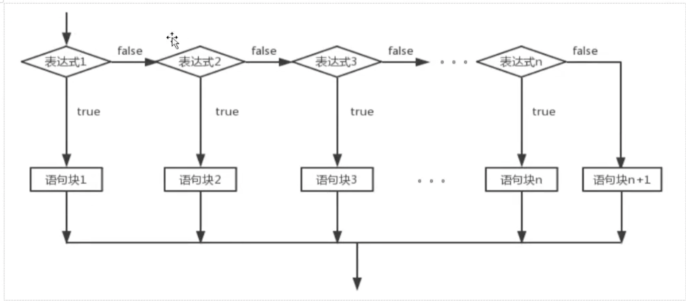

            3. ```java
               int age  = (int)(100*Math.random());//生成0到99的数字
                       System.out.print("生成的年纪是:"+age+",属于:");
                       if(age<15){
                           System.out.println("儿童，喜欢玩!");
                       }else if(age<25){
                           System.out.println("青年，要学习!");
                       }else if(age<45){
                           System.out.println("中年，要工作!");
                       }else if(age<65){
                           System.out.println("中老年,要补钙!");
                       }else if(age<85){
                           System.out.println("老年,多运动!");
                       }else{
                           System.out.println("老寿星,古来稀!");
                       }
               ```

         5. switch结构:

            1. switch多分支结构:

            2. ```java
               #语法结构:
               switch(表达式){
               	case 值1:
               			语句序列1；
               			break;
               	case 值2:
               			语句序列2;
               			break;
               	case 值3:
               			语句序列3;
               			break;
               	default:
               		   默认语句;
               }
               ```

            3. switch语句:会根据表达式的值，从相匹配的case标签处开始执行，一直执行到break语句处或者是switch语句的末尾，如果表达式的值与任一case值不匹配，则进入到default语句(如果存在default语句的情况)，根据表达式的值不同可以执行许多不同的操作，switch语句中case标签，在JDK1.5之前必须是整数(long类型除外),或者是枚举，不能是字符串在JDK1.7之后可以使用字符串(String)。

            4. 需要注意的是:当布尔类型的值是等值判断的情况，可以使用if-else if -else多分支结构，或者switch结构，如果布尔表达式区间判断的情况，则只能使用if-else if -else多分支结构， 

            5. 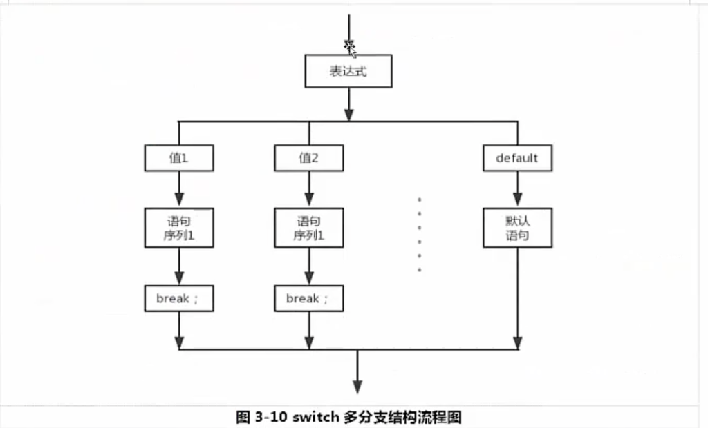

            6. ```java
               Scanner scanner = new Scanner(System.in);
                       System.out.println("请输入1,2,3");
                       int grade = scanner.nextInt();
                       switch (grade){
                           case 1:
                               System.out.println("当前是大学一年级");
                               break;
                           case 2:
                               System.out.println("当前是大学二年级");
                               break;
                           case 3:
                               System.out.println("当前是大学三年级");
                               break;
                           default:
                               System.out.println("输入错误");
                       };
               ```

            7. ```java
               Scanner scanner= new Scanner(System.in);
                       System.out.println("请输入当前的月份:");
                       int month = scanner.nextInt();
                       switch (month){
                           case 1:
                           case 2:
                           case 3:
                               System.out.println("春季");
                               break;
                           case 4:
                           case 5:
                           case 6:
                               System.out.println("夏季");
                               break;
                           case 7:
                           case 8:
                           case 9:
                               System.out.println("秋季");
                               break;
                           case 10:
                           case 11:
                           case 12:
                               System.out.println("冬季");
                               break;
                           default:
                               System.out.println("输入错误");
                       }
               ```

         6. 循环结构:

            1. 循环结构分为两大类一类是当型，一类是直当型。

            2. 当型循环:当布尔类型条件为true时，反复执行某语句，当布尔类型为false时才停止循环，比如while 与for循环

            3. 直当型:先执行某个语句，在判断布尔表达式，如果是true，在执行某个语句，如此反复直到布尔类型条件表达式为false才停止循环，比如do-while循环。

            4. ```java
               while循环
               //语法结构:
               while(布尔表达式){
               		//循环体
               };
               在循环刚开始的时候，会计算一次，布尔表达式的值，若条件为真，执行循环体，而对于后来每一次额外的循环，都会在开始前重新计算一次。
               语句中应有是循环趋向于结束的语句，否则会出现无限循环"死循环";
               ```

            5. 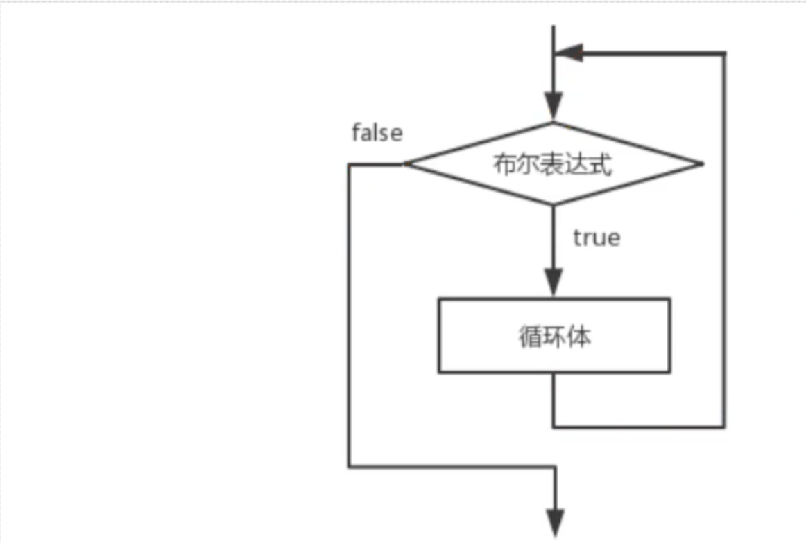

            6. ```java
               //计算1到100的值			
               int sum = 0;
                       int i = 0;
                       while (i<101){
                           sum+=i;
                           i++;
                       }
                       System.out.println("从0到100的值是:"+sum);
               ```

            7. ```java
               do --while循环:
               do{
               	循环体
               }while(布尔表达式);
               do-while循环结构会先执行循环体，在进行条件判断，条件是布尔类型的变量，如果条件是真true的话,执行循环体，否则结束循环，do-while 至少执行一次循环体，
               ```

               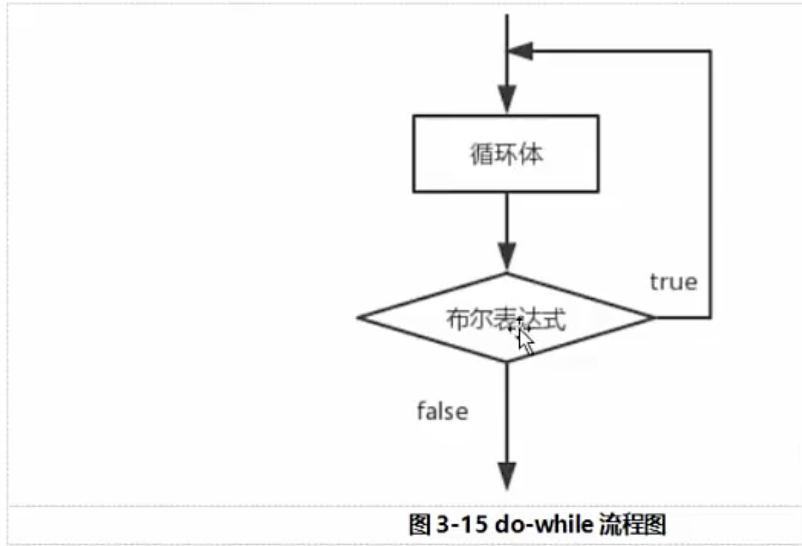

               ```java
               //do-while 计算1到100的和。
               //do-while 先执行在判断，
               //while循环先判断在执行
               int  i  = 0;
                       int sum =0;
                       do{
                           sum+=i;
                           i++;
                       }while(i<101);
                       System.out.println("1到100的和是:"+sum);
               ```

            8. ```java
                int i = 0;
                       int sumOuShu = 0;//偶数和
                       int sumOdd = 0;//奇数和
                       int sum  =0;//总和
                  
                       while (i<101){
                           if(i%2==0){
                               sumOuShu+=i;
                           }else {
                               sumOdd+=i;
                           }
                           i++;
                       }
                       sum=sumOdd+sumOuShu;
                       System.out.println("1到100的总和是:"+sum);
                       System.out.println("1到100的偶数和是:"+sumOuShu);
                       System.out.println("1到100的奇数和是"+sumOdd);
               ```

            9. 

               ```java
                      //打印1到130之间的数字，每行现实5个
                      int i =0;
                       while (i<131){
                           System.out.print(i+" ");
                           if ((i+1)%5==0){
                               System.out.println("");
                           }
                           i++;
                       }
               ```

         7. for循环:

            1. ```java
               //语法结构:
               for(初始化条件;布尔表达式;迭代因子){
               		循环体;
               }
               //for循环语句是支持迭代的一种通用结构，是最有效的，最灵活的循环结构，for循环在第一次反复之前要进行初始化，即执行初始化表达式;随后,对布尔类型进行判定，若判定结果为true的话，则执行循环体，否则，终止循环；最后每一次反复的时候，进行某种形式的步进，即执行迭代因子。
               初始化部分设置循环变量的初值;
               条件判断部分为任意布尔表达式
               迭代因子控制循环变量的增减
               for循环在执行条件判定后，先执行的循环体部分，在执行步进。
               
               ```

               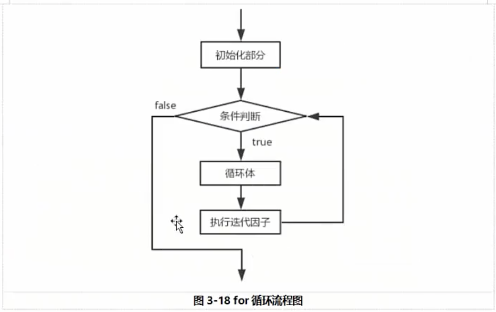

            2. ```java
               //计算1到100的和
                       int sum = 0;
                       for(int i=0;i<101;i++){
                            sum+=i;
                       }
                       System.out.println("1到100的和是"+sum);
               
                       //循环输出9到1之间的数
                       for(int i =9;i>0;i--){
                           System.out.println("当前i的值是:"+i);
                       }
                       //循环输出90到0 之间的可以被3整除的数
                       for(int i=90;i>0;i-=3){
                           System.out.println("当前能被3整除i的值是"+i);
                       }
               ```

         8. 逗号表达式:

            1. Java里面可以用到逗号运算符的地方屈指可数，其中一处就是for循环的控制表达式，在控制表达式的初始化和步进控制部分，我们可以使用逗号表达式，而且哪一些表达式均可以独立执行。

               ```java
               for(int i=0,j=i+1;i<10;i++,j=j*2){
                           System.out.println("当前i的值是"+i+",当前j的值是:"+j);
                       }
               ```

         9. 嵌套循环:

            1. 在一个循环语句内部嵌套一个循环或者多个循环，称为嵌套循环，while ,do-while与for循环可以任意嵌套多层。

            2. ```java
               //打印九九乘法表
               for(int i =0;i<10;i++){
                           for (int j = 0; j <10 ; j++) {
                               System.out.println("当前i的值是:"+i+",当前j的值是:"+j);
                           }
                       }
               
               
               //打印五乘五的方阵
               for (int i = 0; i <5 ; i++) {
                           for (int j = 0; j <5 ; j++) {
                               System.out.print("*\t");
                           }
                           System.out.println();
                       }
               
                  //使用嵌套循环打印一下图形
               
                       for (int i = 0; i <5 ; i++) {
                           for (int j = 0; j <5 ; j++) {
                               if(j%2==0){
                                   System.out.print("*\t");
                               }else{
                                   System.out.print("#\t");
                               }
                           }
                           System.out.println();
                       }
               
               ```

         10. break和continue:

             1. 在任何循环语句的主体中，均可用break控制循环的流程，break用于强行退出循环，不在执行循环中剩余的语句。

             2.  

                ```java
                 //随机产生1到100的之间的数，遇到88的时候停止循环,并统计产生多多少次
                        int count =0;//统计运行了多少次
                        while (true){
                            count++;
                            int i = (int)Math.round(Math.random()*100);//产生的随机数
                            if (i==88){
                                break;//停止循环
                            }
                        }
                        System.out.println("总共循环了:"+count+"次");
                ```

             3. continue:语句用在循环体语句中，用于终止某次循环的过程，即跳过循环体中尚未执行的语句，接着进行下一次是否循环执行的判断。

             4. continue:用在while，do-while中，continue语句立刻跳到循环首部，越过了当前循环 其余部分,用在for循环中，跳到for循环的迭代因子部分

             5. ```java
                        //把100到150之间不可以被3整除的数输出，每行显示5个
                        int count_01 = 0;
                        for (int i = 100; i <151 ; i++) {
                            if(i%3==0){
                                continue;
                            }
                            count_01++;
                            System.out.print("当前的值是:"+i+"\t");
                            if (count_01%5==0){
                                System.out.println();
                            }
                        }
                ```

             6. 带标签的break语句和continue语句:goto关键字很早就在程序设计语言中出现，尽管goto语句是java的一个保留关键字，但是未在Java中得到正式使用，Java没有goto语句。然而在break和continue这两个关键字的身上，我们依然可以看到goto的影子--带标签的break和continue,标签是指后面跟着一个冒号标识符，例如"label:".对java来说唯一用到标签的地方是在循环语句之前，而在循环之前设置的标签唯一理由是,我们希望在其中嵌套另外一个循环，由于break和contine关键字，通常只当前循环，但若随标签使用，它们会就会中断到存在标签的地方，在goto有害论中，最有问题的标签，而非goto，随着标签在一个程序中里面数量的增多，产生错误的机会也越来越多，但Java标签不会造成这方面的问题，因为它们的活动场所被限制，不可通过特别的方式到处传递程序的控制权，由此也引发了一个有趣的问题:通过限制语句的能力，反而能使一项语言特性更加有用。

             7. ```java
                  //打印100到150之间的质数
                        outer:for (int i = 100; i <150 ; i++) {
                            for (int j = 2; j <i/2 ; j++) {
                                if(i%j==0){
                                    continue outer;
                                }
                            }
                            System.out.println(i+"\t");
                        }
                ```

             8. 作业:

                1. 薪水计算器:通过键盘输入用户的月薪，每年是几个月的薪水，输出用户的年薪，知道键盘输入exit,则这个退出程序，输入中途，键盘输入next,则这个用户退出计算，算下一个用户的年薪.

                2. ```java
                   //薪水计算器:通过键盘输入用户的月薪，每年是几个月的薪水，输出用户的年薪，
                           // 直到键盘输入exit,则这个退出程序，输入中途，键盘输入next,则这个用户退出计算，算下一个用户的年薪
                           System.out.println("年薪计算器小软件");
                           Scanner scanner = new Scanner(System.in);
                           while (true){
                               System.out.println("请输入用户的月薪");
                               int monthSalary  = scanner.nextInt();
                               System.out.println("请输入用户是多少薪");
                               int months = scanner.nextInt();
                               int yearSalary = months*monthSalary;//年薪
                   
                               System.out.println("年薪是"+yearSalary);
                               if(yearSalary>=1000000&& yearSalary<2000000){
                                   System.out.println("恭喜你，超过了99%的国人");
                               }else if(yearSalary>=200000){
                                   System.out.println("恭喜你，超过了100%的国人");
                               }
                               System.out.println("请输入exit或者next,exit退出程序，next计算下一个年薪");
                               scanner.nextLine();
                               String command = scanner.nextLine();
                   
                               if ("exit".equals(command)) {
                                   System.out.println("退出软件");
                                   break;
                               }else if("next".equals(command)){
                                   System.out.println("计算下一个用户的的年薪");
                                   continue;
                               }else {
                                   System.out.println("指令错误，，程序退出");
                                   break;
                               }
                           }
                   ```

   8. 方法:

      1. 语句块:语句块(有时候被称为复合语句，)使用花括号括起来的任意数量的简单的java语句，块明确啦局部变量的作用域，块中的代码块，作为一个整体，是要被一起执行的。块可以被嵌套在另外一块中，但是不能在两个嵌套块内声明同名的变量，语句块可以使用外部的变量，而不能使用语句块中定义的变量，因为语句块中定义的变量作用域在限制在语句块内。

      2. 定义:

         1. 方法就是一段用来完成特定功能的代码片段，类似于其他语言的函数。

         2. 方法用于定义该类的实例的行为特征和功能的实现，方法是类和对象特征的抽象，方法很类似于面向过程中的函数，面向过程中，函数是最基本的单位，整个程序由一个个函数调用组成的，面向对象中，整个程序的基本单位是类，方法是从属于类和对象的。

         3. ```java
                //方法的定义
            //    [修饰符1  修饰符2 ...] 返回值类型  方法名称(形式参数列表){
            //        java语句
            //    }
            
            
                //方法的调用
            //    对象名.方法名称(实参数列表)
            ```

         4. 方法的详细说明:

            1. 形式参数:在方法声明时用于接收外界传入的数据
            2. 实参:调用方法时实际传给方法的数据
            3. 返回值:方法执行完毕后返还给调用它的环境的数据
            4. 返回值类型:实现约定的返回值的数据类型，如无返回值，必须显示指定为void。

         5. ```java
            //定义一个没有返回值的参数
                public static void loveU(){
                    System.out.println("I Love U!");
                }
            
                //定义一个返回值为整数的方法
                public static int add(int num1,int num2){
                    return num1+num2;
                }
                
                //方法的调用
                    loveU();
                    //方法的调用
                    int a_01 = add(1,2);
                    System.out.println(a_01);
            ```

         6. 实参数的目的，数据类型和次序必须和所调用的方法声明的形式参数列表匹配。

            1. return 语句终止方法的运行并指定返回的数据
            2. java中进行方法的调用中传递参数时，遵循值传递的的原则(传递的都是数据的副本)。
               1. 基本类型传递的该数据的copy值
               2. 引用类型传递的是该对象引用copy值，但指向的同一个对象。

         7. 方法的重载(overload):

            1. 方法的重载是值一个类中可以定义多个方法名相同，但是参数不同的方法，调用时，会根据不同的参数自动匹配对应的方法。

            2. 构成重载的条件:

               1. 不同的含义:形参类型，形参个数，形参顺序不同
               2. 只有返回值不同不构成方法的重载。
               3. 只有形参的名称不同，不构成方法的重载。

            3. ```java
               /**
                    *  方法的重载
                    * @return
                    */
                   public static int add(){
                       return 0;
                   }
               
                   /**
                    * 方法的重载
                    * @param i
                    * @param j
                    * @return
                    */
                   public static int add(int i ,int j){
                       return i+j;
                   }
               
                   /**
                    * 方法的重载
                    * @param i
                    * @param j
                    * @param k
                    * @return
                    */
                   public  static int add(int i,int j,int k){
                       return i+j+k;
                   }
                   /**
                    * 方法的重载
                    * @param i
                    * @param j
                    * @return
                    */
                   public static double add(double i,double j){
                       return i+j;
                   }
               
               
                   public static String add(String name,int i){
                       return "name"+i;
                   }
               ```

         8. ```java
            //定义一个方法处理迟到问题。
                //输入参数 员工名称和月薪
                //处理逻辑:
                //迟到10分钟，警告。。迟到11-20分钟 罚款100。迟到21-30分钟 罚款200
                //迟到30分钟以上 扣除半天工资
                //迟到1个小时以上，按照旷工处理扣除3日工资
                //输出返款金额和处理意见
            
                public static void chidao(String name,double salary,int latetime){
                    double fakuan = 0;
                    if(latetime<0&& latetime>=10){
                        System.out.println("警告！！！以后不在迟到啦");
                    }else if(latetime>=11&& latetime<=20){
                        System.out.println("罚款100元");
                        fakuan =100;
                    }else if(latetime>=21&& latetime<=30){
                        System.out.println("罚款200元");
                        fakuan =200;
                    }else if (latetime>=31&&latetime<=60){
            
                        fakuan = (int)(salary/21.75*2);
                        System.out.println("扣除半天工资"+);
                    }else {
                        fakuan = (int)(salary/21.75)*3;
                        System.out.println("扣除三天工资:"+fakuan);
            
                    }
            ```

   9. 递归结构:

      1. 递归是一种常见的解决问题的方式，就是把问题逐渐简单化，递归的基本思想就是"自己调用自己",一个使用递归技术的方法将会直接或者间接大调用自己。

      2. 利用递归可以简化程序的来解决一些复杂的问题，比如：斐波那契数列，汉诺塔，快排等问题。

      3. 递归结构分为两个部分:

         1. 定义递归头:解答;什么时候不调用自身方法，如果没有头的，陷入死循环，递归头也就是递归结束的条件。
         2. 递归体:什么时候需要调用自身方法。

      4. ```java
         /**
              * 计算阶乘
              * n=1 1*1
              * n=2 1*2
              * n=3 1*2*3;
              */
             public static int  jiecheng(int n){
                 if(n==1){//递归头
                     return 1;
                 }else {//递归体
                    return n*jiecheng(n-1);
                 }
             }
         
             /**
              * 斐波那契数列
              * @param n
              * @return
              */
             public static int Fibonacci(int n){
                 if (n==0){//
                     return 0;
                 }else if(n==1){
                     return 1;
                 }else{
                     return Fibonacci(n-1)+Fibonacci(n-2);
                 }
             }
         ```

8. 面向对象:

   1. 表格结构和类结构:

      1. 我们在现实生活中，思考问题，处理问题，往往都是使用表格作为工具。实际上，表格思维就是一种典型的面相对象思维。
      2. 实际上互联网上大多数数据的本质都是表格，我们在这里通过从表格表示数据开始，引入对象和类大家就会发现原来表格就是对象。

   2. 面向对象和面向过程的区别:

      1. 面向过程和面向对象，都是对软件分析，设计和开发的一种思想，他指导这人们以不同的方法分析，设计和开发软件，早期现有面向过程思想，随着软件的规模的扩大，问题的复杂性的提高，面向过程的弊端越来越明显的显示出来，出现了面向的对象思想并成为目前主流的方式，两者都贯穿于软件分析，设计和开发的各个阶段，对应面向对象就分别称为面向对象分析式(OOA),面向对象设计(OOD)，和面向对象编程(OOP),C语言是一种典型的面向过程语言，Java是一种典型面向对象语言
      2. 面向过程思考问题时候，我们首先思考，怎么按步骤实现，并且将对应成方法，一步一步，最终完成，这个适合简单的任务，不需要过多协作的情况下。比如如何开车，我们很容易就可以实现这个步骤。
      3. 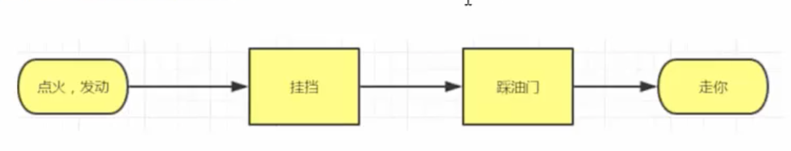
      4. 但是但我们思考复杂的设计任务的时候，比如如何造车，就会列出来1234这样的步骤，是不可能实现，那是因为，造车很复杂需要很多的协作才可以完成，此时面向对象就出现啦。
      5. 面向对象思想更加契合人的思维模式，我们首先思考的是怎么设计这个东西，比如我们想造车，我们要想的话怎么去设计车，而不是按照步骤造车，这就是思维方式的转变。
      6. 面向对象和面向过程都是解决问题的思维方式，都是代码组织的方式
         1. 面向过程是一种执行者的思维，解决简单问题可以使使用面向过程
         2. 面向对象是一种设计者思维，解决复杂，需要协作的问题可以使用面向对象解决。
         3. 面向对象离不开面向过程:
            1. 宏观上:通过面向对象进行整体上设计
            2. 微观上:执行和处理数据，仍然是面向过程。

   3. 对象和类的概念:

      1. ​	在我们人类的认知中，其实就是面向对象，比如我们现在让大家认识一下天使，我们大家都不知道是什么样的，最好的办法就是，给你们摆在面前的4个天使，带翅膀的美女，让大家看，看完之后大家都认识啦。

      2. 类可以看作是一个模版,或者是图纸，系统根据类定义造出来的对象，我们要造一个车，怎么造，类就是这个图纸，规定了汽车的详细信息，然后根据图纸将汽车造出来。

      3. 类:我们称之为class，对象我们称之为Object，instance(实例)，以后我们说某个类的对象，某个类的实例，是一样的意思。

      4. ```java
         //属性用来定义该类或者该对象包含的数据或者静态的特征，属性作用范围是整个类体，
             //在定义成员变量时候可以对其进行初始化，如果不对其进行初始化，Java使用默认的值对其初始化。
             int id;//
             String stuName;
             int age;
         
             //方法:用于定义该类或者该类实例的行为特征和功能实现，方法是类和对象行为特征的抽象，
             // 方法很类似于面向过程中的函数，函数是最基本的单位，整个程序有一个个函数调用组成，
             //面向对象过程中，整个程序是最基本单位是类，方法是从属于类和对象的。
             //方法的定义格式:
             //[修饰符] 方法返回值类型 方法名称(形参数列表){
             //  语句
             // }
         
             void study(String 学习){
                 System.out.println("开始上课啦");
             }
         
             //构造方法---
             Car(){
         
             }
         ```

      5. 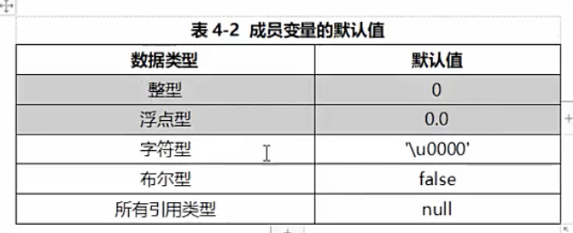

      6. 属性定义格式:

         1. [修饰符号] 属性类型 属性名=值；

         2.  

            ```java
            int id;//
                String stuName;
                int age;
            ```

      7. 方法的定义格式:

         1. ```java
            //[修饰符] 方法返回值类型 方法名称(形参数列表){
                //  语句
                // }
            void study(String 学习){
                    System.out.println("开始上课啦");
                }
            ```

      8. 构造方法的基础用法:

         1. 构造器也被称为构造方法，用于对象的初始化，构造器是一个创建对象时候被自动调用的特殊方法，目的是对象的初始化，构造器的名称应该与类保持一致，Java通过new关键字来调用构造器，从而返回该类的实例,是一种特殊的方法。

         2. ```java
            //类的名字 ==方法的名字()
            //声明格式
            [修饰符] 类名(形参数列表){
              //n语句
            }
                Car(){
            
                }
            ```

         3. 构造器4个要点:

            1. 构造器通过new关键字调用，构造器虽然存在返回值，但是不能定义返回值(返回值的类型肯定是类本身)不可以在构造器中使用return返回某个值。

            2. 如果我们没有定义构造器，则编译器会自动定一个无参数的构造函数，如果已经定义，则编译器不会自动添加

            3. 构造器的方法必须和类名一致。

            4. ```java
               double x,y;
               
                   public Point(double _x,double _y){
                       x = _x;
                       y = _y;
                   }
               
               
               
                   public double adddouble(Point point){
                       return Math.sqrt((x-point.x)*(x-point.x)+(y-point.y)*(y-point.y));
                   }
               
               
                   public static void main(String[] args) {
                       Point point1= new Point(3,4);
                       Point point2 =new Point(0,0);
                       double aa = point1.adddouble(point2);
                       System.out.println(aa);
                   }
               ```

   4. 面向对象内存分析:

      1. java虚拟机内存模型概念: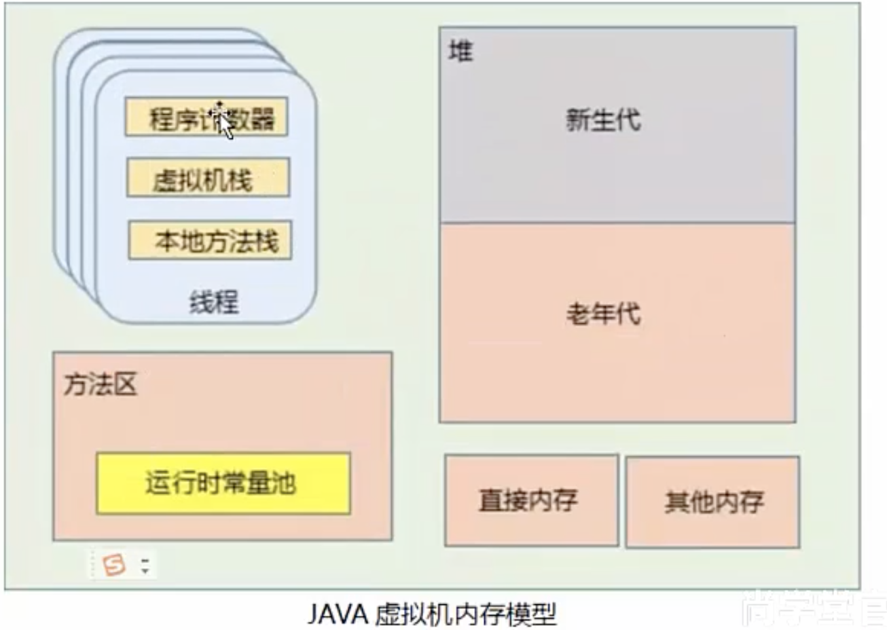
      2. 从属于线程的内存区域:
         1. JVM的内存区域划分中，有部分区域是线程私有的，有部分区域是属于整个JVM进程的，我们将这一部分归为一类。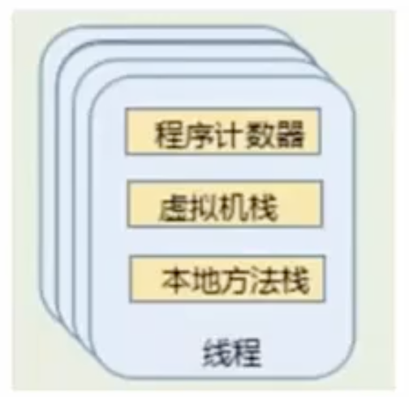
            1. 程序计数器，在JVM规范中，每个线程都有自己的程序计数器，这是一块比较小的代码空间，存储在当前线程正在执行的Java方法的JVM指令地址，即字节码的行号，如果正在执行的Native方法，则这个计数器为空。
            2. 虚拟机栈(Java Virtal Machine Stack),同样也是属于线程私有区域，每个线程在创建的时候都会创建一个虚拟机栈，生命周期与线程一致，线程退出时候，线程的虚拟机栈也被回收，虚拟机栈内部保持一个个栈帧，每次调用都会
            3. 本地方法栈:与虚拟机的栈类似，本地方法栈实在调用本地方法的时候，每一个线程都有一个本地方法栈。
         2. 堆:
            1. 堆:几乎所有的创建的Java对象实例，都是被直接分配到堆上的，堆被所有的线程所共享，，在堆上的区域，会被垃圾回收器做进一步划分，例如新生代，老年代的划分，Java虚拟机在启动的时候，可以使用"Xmx"之类的参数指定堆区域的大小。
         3. 方法区:
            1. 方法区和堆一样，也是所有的线程共享，存储在虚拟机加载的元数据，包括类的信息，常量，静态变量，即时编译器编译后的代码等数据。
            2. 方法区实际上也是一种Java虚拟机的规范，由于方法区的数据和堆存储的数据一致，实质上也是堆，因此，在不同的JDK版本中方法区的实现方式不一样。
            3. JDK7以前，方法区就是堆中的永久代，JDK开始去，永久化把静态变量，字符串常量池等等都挪到了堆内存中。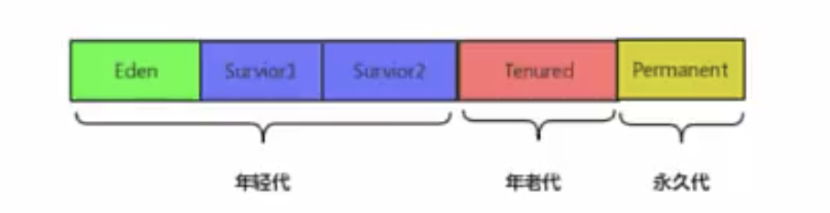
            4. JDK8以后,永久代不在存在，存储类的信息，编译的代码数据已经移动到啦MetaSpace(元空间里面)，元空间并没有在堆内存中，而是占用本地的内存的。
            5. 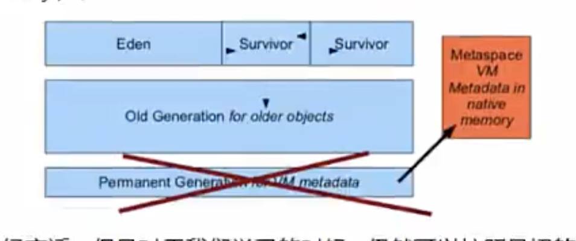
            6. 运行时常量池:
               1. 这是方法区的一部分，主要存放两大类变量:
                  1. 字面量:如文本字符串，final常量
                  2. 符号引用,存放啦与编译相关的一些常量，因为Java不像是C++那样有链接的过程，因此字段方法这一些符号引用在运行期就需要进行转换，以便得到真正的内存入口地址。
            7. 直接内存:
               1. 直接内存并不属于Java规定的属于Java虚拟机运行时数据区的一部分，Java的NIO可以使用Native方法直接在java堆外的分配内存，使用DirectByteBuffer对象作为这个堆外内存的引用。

   5. 程序执行内存分析过程:虚拟机栈(stack) 堆heap 方法区:method area

      1. 虚拟机栈特点如下:
         1. 栈描述的是方法执行的内存模型，每个方法被调用都会创建一个栈(存储局部变量，操作数，方法出口等等)
         2. JVM为每个线程创建一个栈，用于存放该线程执行方法的信息(实际参数，局部变量等)
         3. 栈属于线程私有，不能实现线程间的共享。
         4. 栈的存储特点是"先进后出，后进先出"
         5. 栈是有系统自动分配，速度快，栈是一个连续的内存空间。
      2. 堆的特点:
         1. 堆用于存储创建好的对象和数组(数组也是对象)
         2. JVM只有一个堆，被所有线程共享
         3. 堆是一个不连续的内存空间，分配灵活，速度慢
      3. 方法区(静态区)特点如下:
         1. 方法区域是JAVA虚拟机规范，可以有不同的实现。
            1. JDK7以前被称为"永久代"
            2. JDK7部分去除"永久区"，静态变量，字符串常量池，都挪到啦内存中，
            3. JDK8是元数据空间和堆结合起来。
         2. JVM只有一个方法区，被所有线程共享
         3. 方法区实际上也是堆，只是用于存储类，常量相关的信息
         4. 用来存储程序中永远是不变的或者唯一的内容(类信息,静态变量，字符串常量等)
      4.  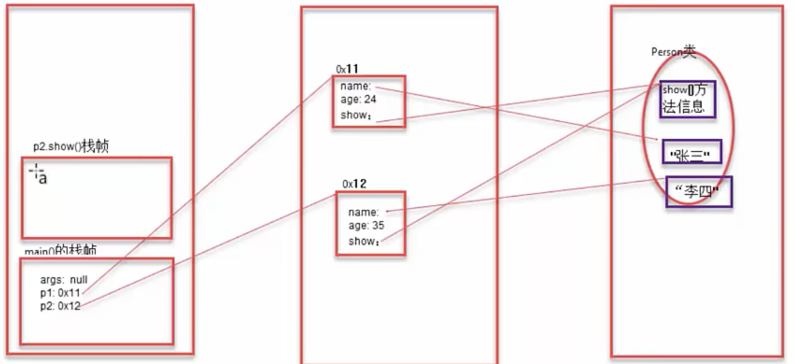

9. 垃圾回收机制:

   1. 垃圾回收的原理和算法:
      1. 内存管理:Java的内存管理很大程度上指的就是:堆中的对象，其中包含对象空间的分配和释放，
      2. 对象空间的分配:使用new关键字创建对象即可。
      3. 对象空间的释放:将对象赋值null即可，垃圾回收器将负责回收所有的不可达对象的内存空间。
   2. 垃圾回收过程:
      1. 任何一种垃圾回收的算法一般要做两件事
         1. 发现垃圾
         2. 回收无用对象占用的内存空间
      2. 垃圾回收机制可以将无用的对象进行回收，无用的对象指的就是没有任何变量引用该对象，Java的垃圾回收通过相关算法发现无用对象，并进行清除和整理。
      3. 垃圾回收相关算法:
         1. 引用计数法:
            1. 堆中的每个对象都对应一个引用计数器，当有引用对象指向这个对象的时候，引用计数器加1，而当指向该对象的引用失效(引用变成null),引用计数器增加1，最后如果该对象的引用计算器的指为0的时候，则java垃圾回收器会认为该对象是无用对象并对其进行回收，优点是算法简单，缺点是‘循环引用的无用对象’，无法识别。
         2. 引用可达法(根搜索算法):
            1. 程序把所有的引用关系看作一张图，从一个节点GCRoot 开始，寻找对象的引用节点，找到这个节点以后，继续寻找这个节点的引用节点，当所有的引用节点寻找完毕之后，剩余的节点则被认为是没有被引用到的节点，即无用的节点。
      4. 通用的分代垃圾回收机制:
         1. 分代垃圾回收机制，是基于这样一个事实，不同的对象的生命周期是不一样，因此，不同生命周期的对象可以采取不同的回收算法，以便提高回收效率，我们将对象分为三种不同状态：年轻代，年老代，持久代，同时将处于不同的状态的对象放到堆中不同的区域，JVM将堆划分为Eden，Survivor和Tenured/Old空间。
         2. 年轻代:
            1. 所有新生成的对象首先都是放在Eden区内的，年轻代的目标就是尽可能快速的收集掉哪一些生命周期短的对象，对应的是Minor GC，每次Minor GC会清理年轻代内存，算法采用效率较高的复制算法，频繁的操作，但是会浪费内存空间，当年轻代区域存放在满对象后，就将对象存放到年老代区域。
         3. 年老代:在年轻代经历了N(默认是15次)垃圾回收仍然存活的对象，就会被放到年老代中，因此可以认为年老代中存放是一些生命周期较长的对象，年老代对象越来越多，我们就需要启动MajorGC和full(全量回收)，来一次大扫除，全面清理年轻代区域和年老代区域。
         4. 永久代:由于存放静态文件，如Java类，方法等，持久代对垃圾回收没有显著影响，JDK7以前就是方法区的一种实现，JDK8以后已经没有永久代，使用了metaspace元数据空间和堆替代。
         5. 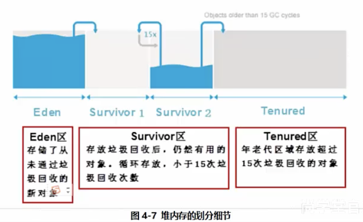
         6. MinorGC:用于清理年轻代区域，Eden区域满了就会触发一次MinorGC，清理无用对象，将有用的对象复制到Survivor1，Survivir2区域中。
         7. MajorGC:用于清理年老代区域
         8. FullGC:用于清理年轻代，年老代区域，成本较高，会对系统产生影响。
   3. JVM调优和FullGC:
      1. 在对JVM调优的过程中，很大的一部分工作就是对于FullGC的调节，有如下原因可能导致FullGC
      2. 年老代被写满
      3. 持久代被写满
      4. System.gc被显示调用
      5. 上一次GC之后，heap的各域分配策略动态变化。
   4. 开发中容易造成造成内存泄漏的操作:
      1. 创建无用的对象:比如我们在做大量拼接字符串的时候,使用了String，而不是StringBuilder.
      2. 静态集合类的使用:
         1. 想HashMap，Vetor，List等使用最容易出现内存泄漏的,这一些静态变量的生命周期和应用程序一致，所有的对象Object也不能够被释放。
      3. 各种链接对象(IO流对象，数据库连接对象，网络连接对象)未关闭。
         1. IO流对象，数据库连接对象，网络连接对象等连接对象属于物理连接，和硬盘或者网络连接的时候，不使用的时候一定要关闭 
      4. 监听器的使用:
         1. 释放对象没有删除对应的监听器。
      5. 其他要点:
         1. 程序员无权调用垃圾回收器
         2. 程序员可以调用System.gc()，该方法只是通知JVM并不是运行垃圾回收器，尽量少用，会申请启动FullGC，成本比较高，影响系统性能。
         3. finalize方法，是Java提供给程序员用来释放对象或者资源的方法，但是尽量少用，

10. this static关键字:

    1. 对象创建的过程和this本质:

       1. 构造方法的是创建java对象的重要途径，通过new关键字调用构造器时，构造器也确实返回该类的对象，但这个对象并不是完全有构造器负责创建的，创建一个对象分位如下四步:
          1. 分配对象空间，并将对象成员变量初始化为0或者空。
          2. 执行属性的值，显示初始化。
          3. 执行构造方法。
          4. 返回对象的地址相关的变量。
          5. this关键字的本质是"创建好的对象的地址，"由于在构造方法调用前，对象已经被创建，因此,在构造方法中也可以使用this代表当前对象。

    2. this常用的对象:

       1. 在程序产生二义性之处，应使用this来指明当前对象，普通的方法中，this总是指向调用该方法的对象，构造方法中,this总是指向正要初始化的对象。
       2. 使用this关键字调用重载的构造方法，避免相同的初始化代码，但只能在构造方法中的第一句
       3. this不能用在static方法中。

    3. ```java
           int id;
           String name;
           String pwd;
       
          public User(String pwd,int id,String name) {
               this(id,name);//可以调用其他类型的构造器，并且必须位于第一行 
               this.pwd = pwd;
           }
       
           public void User(int id ,String name){
               this.id = id;
               this.name =name;
           }
       
           public void login(){
               System.out.println("我的用户名是:"+this.name);
           }
       ```

11. static关键字:

    1. 在类中,用static关键字声明的成员变量被称为静态变量，也成为类变量，类变量的额声明周期和类相同，在整个应用程序之间都有效，他有如下特点:

       1. 为该类的公用变量，属于类，被该类的所有实例共享，在被类载入的时候，被显式初始化，

       2. 对于该类 所有对象来说，stati成员变量只有一份，被该类 所有对象共享。

       3. 一般类名.类属性/方法来调用，(也可以通过对象应用或者类名)来访问静态成员。

       4. 在static方法中不可直接访问非 static的成员。

       5.  

          ```java
          int id;
              String name;
              String pwd;
          
              static String  comPany ="北斗星IT科技";
          
              public User_01(int id, String name, String pwd) {
                  this.id = id;
                  this.name = name;
                  this.pwd = pwd;
              };
          
          
              //非static方法
              public void login(){
                  System.out.println("登陆名称:"+this.name);
              }
          
              //static方法
              public static void printCompany(){
                  //static 属性可以直接调用
                  System.out.println("公司名称是:"+comPany);
              }
          
          
              public static void main(String[] args) {
                  //static 方法通过类名直接调用
                  User_01.printCompany();
          
                  User_01 user_01= new User_01(0,"闫天蓬","123456");
                  //非static方法通过对象名.方法名调用
                  user_01.login();
          
              }
          ```

       6. 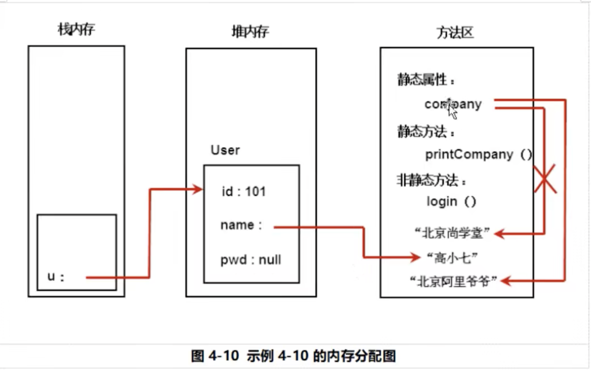

       7.  静态初始化块:

          1. 构造方法不能用于对象的初始化，静态初始化块，用于类的初始化操作，在静态初始化块中不能直接访问非static成员的变量。

12. 变量的分类:

    1. 从整体上我们可以把变量分为局部变量，成员变量和静态变量.
    2. 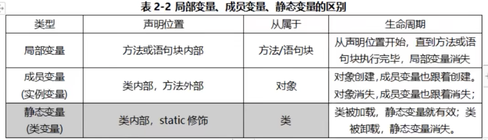
    3. 局部变量:
       1. 方法或者语句块内部定义的变量，生命周期是从声明的位置开始到方法或语句块执行完毕为止，局部变量在使用前必须先声明，初始化在使用。

13. 包机制:

    1. 包机制是Java中管理类的重要手段，开发中我们会遇到大量同名的类，通过包我们相对容易的对解决类重名的问题，也可以实现对类的有效管理，包对于类，相当于文件夹对于文件。

    2.  package:我们通过package实现对类的管理，package的使用有两个特点

       1. 通常是类的第一句非注释性语句。

       2. 包名:域名到着写即可，在加上模块的名字，便于内部管理。

       3. ```java
          com.beidouxing.test
          com.shanghai.module
          ```

       4. 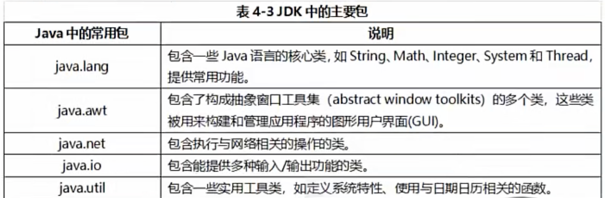

    3. import 导入类:

       1. 如果我们要使用其他包的类，需要使用import导入，从而可以在本类中直接通过类名来调用，否则我们后面书写类的完整包名和类名，import后，便于编写代码，提高可维护性。

       2. ```java
          package com.yantianpeng.day_07.test_02;
          import com.yantianpeng.day_07.test_01.Students;//导入其他包中的类
          import java.sql.Date;
          
          public class class_01 {
          
          
              Date now;//导入sql包的中时间处理类
          
              public static void main(String[] args) {
                  Students student= new Students(1,"张三",true);
                  student.login();;
              }
          }
          ```

    4. 静态导入 static:

       1. 静态导入是(static import )在jdk1.5之后新增的一个功能，其作用是导入指定类的静态属性，这样我们可以直接使用静态属性。

       2. ```java
          import static java.lang.Math.PI; //导入静态变量PI
          import static java.lang.Math.*;//导入Math类中所有的静态属性
          
          public class Test_static {
          
          
              public static void main(String[] args) {
                  System.out.println("圆周率是:"+PI);
                  System.out.println("圆周率是:"+ PI);
              }
          
          }
          
          ```

14. 面向对象:

    1. 继承:继承是面向对象的三大特性之一，它让我们更加容易的实现对已有类的扩展，更加容易实现对现实世界的建模。

    2. 作用:

       1. 代码的复用，更加容易实现类的扩展
       2. 方便对事物建模。

    3. 继承的实现:

       1. 继承让我们更加容易实现类的扩展，比如，我们定义人类，在定义Boy类的时候我们只需要扩展人类即可，实现了代码的复用，不用在重复发明新的轮子，

       2. 从英语字母意思上我们可以知道，extends的意义是扩展，子类是父类的扩展，现实世界中的继承无处不在。

       3. 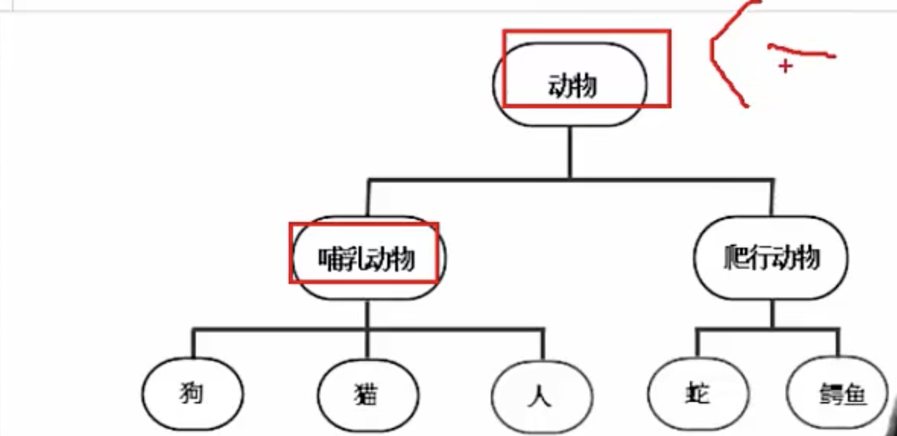

       4. ```java
          class  person{
              int id;
              String name;
              String sex;
          }
          
          
          class  Student extends person{
              String major;//学生自己的属性和方法
          
          
          
              public Student(int id,String name,String sex,String major){
                  //其中id ,name ,sex 等属性都是从父类继承过来的
                  this.id = id;
                  this.name = name;
                  this.sex = sex;
                  this.major = major;
              }
          
          
              public void info(){
                  System.out.println("我的名字是:"+this.name+",我的公司是:"+major);
              }
          ```

    4. 继承使用要点:

       1. 父类也被称为超类，基类。子类:被称为派生类等
       2. Java中只有单继承，没有想C++那样的多继承，多继承会引起结构混乱，使得继承链过于复杂，系统难以维护。
       3. Java类中没有多继承，但是接口有多继承。
       4. 子类继承父类，可以得到父类的全部属性和方法(除了父类的构造方法)，但不见得可以直接之访问(比如父类的私有方法是不能被访问的)
       5. 如果定义一个类的时候，没有调用extends方法，则他的父类是java.lang.object.

    5. 方法的重写:

       1. 子类通过重写父类的方法，可以用自身的行为替换父类的行为，方法的重写是实现多态的必要条件

       2. "==" 方法名和形参数列表必须一致。

       3. "<="返回值类型(可以用在继承里面的返回值)和声明异常类型，子类小于等于父类

       4. ">="访问权限，子类大于等于父类

       5. ```java
          public class person01 {
              int id;
              String name;
              String sex;
            
              public void rest(){
                  System.out.println("开始休息了.....");
              }
          }
          
          
          public class man_person extends person01{
              //子类重写父类的方法，保持方法名称
              public void rest(){
                  System.out.println("男生开始休息了.....");
              }
          }
          ```

          

    6. Instanceof 运算符号:

       1. instanceof 是二元运算符号，左边的对象，右边的是类，当对象是有该类或者该类的子类创建的时候，返回的是true ，否则返回的是false。

       2. ```java
          //instanceof是二元运算符，左边是对象，右边是类，当对象是该类或者子类所创建的对象的时候返回的是true
              //否则返回的事false;
          
          
          
              public static void main(String[] args) {
          
                  User user= new User(1,"张三");
                  System.out.println(user instanceof User);//返回的true
          //        System.out.println(user instanceof User_01);//返回的是false
              }
          ```

    7. final:关键字的作用:

       1. 修饰变量:被他修饰的变量不可改变，一旦赋值，就不能被重新赋值,final int MAX_SPEED = 120;

       2. 修饰方法:该方法不可以被子类重写，但是可以被重载 

       3. 修饰类:修饰的类不能被继承，比如Math，String等。

       4. ```java
          public class Test_final {
          
              //该变量的值，不可以被修改
              final String name ="闫天蓬--开发工程师--5年--阿里P8";
          
          
              //该方法不可以被重写 但是可以被重载
              public final  void rest(){
                  System.out.println("开始休息");
              }
              
          }
          
          final class A{
              //使用final修饰的话  表示此类不可以被继承
          }
          ```

    8. 继承和组合:
    
       1. 我们可以通过继承方便的复用已经定义过的代码，还有一种方式，可以方便的是实现代码的复用，那就是组合。
    
       2. 组合不同于继承，更加灵活
    
       3. 组合就是把父类当成子类的属性，通过调用子类的属性来访问父类的方法和属性。
    
       4. 组合比较灵活，继承只能有一个类，但是组合可以有多个属性，所有有人声称组合优于继承，开发中可以不使用继承，但是一般不建议大家走极端。
    
       5. 继承除了代码的复用，也方便我们对事务进行建模。所以对于"is-a"关系建议使用继承，has-a关系建议使用组合。
    
       6. ```java
          public class Dog {
          
              String name;
              String color;
          
          
              public void shout(){
                  System.out.println("汪汪叫....");
              }
          
          }
          
          
          public class Taidi {
          
          
              Dog dog ;//把父类作为子类的属性，
          
              int age;
          
          
              public static void main(String[] args) {
                  Taidi taidi= new Taidi();
                  taidi.dog.shout();//通过组合的方式调用父类的方法
              }
          }
          ```
    
15. Object类:

    1. Object类基本特性:Object是所有java类的根基类，也就意味着所有的Java对象都拥有Object类的属性和方法，如果我们在类的声明中没有使用extends关键字，我们默认指明其父类， 则默认继承Object。

    2. toString方法:

       1. Object类中定义有public String toString(){};其返回值是String类型， 在Object类中，toString的源码是:

          ```java
           public String toString() {
                  return getClass().getName() + "@" + Integer.toHexString(hashCode());
              }
          ```

       2. 重写toString类:

          ```java
          int id;
              String name;
              String pwd;
          
              //重写toString方法
              public String toString(){
                  return "我的编号是:"+id+",w我的名字是"+name;
              }
          
          
              public static void main(String[] args) {
                  Cat cat = new Cat();
                  System.out.println(cat.toString());
              }
          ```

    3. ==和equals方法:

       1. ==代表比较双方是否相同，如果是基本数据类型表示的是值相等，如果是引用类型表示的是地址相同就是同一个对象。

       2. Object类中定义有:public boolean equals(Object obj)方法，提供定义对象内容类型相等的逻辑，比如我们在公安系统中，认为id相同，就是同一个人，学籍系统中认为学号相同的人就是同一个人。

       3. Object的equals方法默认是比较两个对象的hashcode，是同一个对象的引用时返回的是true，否则返回的false，但我们可以根据我们的要求重写equals方法。

       4. ```java
          public class monkey {
          
              int id;
              String name;
              String pwd;
          
          
          
              monkey(int id,String name,String pwd){
                  this.id = id;
                  this.name = name;
                  this.pwd = pwd;
              }
              //重写父类的方法 比较只有id相等话就表示是同一个对象
              //equals方法的重写 用于比较对象的内容是否相等
              public boolean equals(Object obj) {
                  if (obj==null){
                      return false;
                  }else{
                      if(obj instanceof monkey){
                          monkey monkey1 = (monkey)obj;
                          if(this.id==monkey1.id&&this.name==monkey1.name&&this.pwd==monkey1.pwd){
                              return true;
                          }
                      }
                  }
                  return false;
              }
          
          
          
              public static void main(String[] args) {
                  monkey monkey1 = new monkey(1,"闫天蓬","123456");
                  monkey monkey2 = new monkey(1,"闫天蓬","123456");
          
                  System.out.println(monkey1);
                  System.out.println(monkey2.toString());
                  //直接使用Object中的equals返回的false;
                  //我们可以通过重写来实现判断对象是否相等
                  System.out.println(monkey1.equals(monkey2));
              }
          }
          ```

    4. super():

       1. super 可以看作是直接父类的引用，可以通过super关键字来访问父类中被子类覆盖方法或者属性。

       2. 使用super调用普通方法，语句位置没有限制，可以在子类中随便调用。

          1. 若是构造方法的第一行代码没有显式的调用super()或者this(),那么java默认会调用super();含义是调用父类的无参数构造器方法，这里的super()可以省略。

          2. ```java
             public class TestPigFather {
             
                 public static void main(String[] args) {
                     //实例化子类，也会调用父类的无参数构造器
                     TestPigchilder2 testPigchilder2= new TestPigchilder2();
                 }
             }
             
             
             class  TestPigchilder1{
                  public TestPigchilder1(){
                      System.out.println("父类中的无参数构造器");
                  }
             }
             
             class TestPigchilder2 extends TestPigchilder1{
                     public TestPigchilder2(){
                         //会默认调用父类的无参数构造器
                         System.out.println("子类中无参数构造器");
                     }
             }
             ```

          3. ```java
             public class TestFather {
                 public  int id;
             
                 public void f(){
                     id =100;
                     System.out.println("当前父类的值是:"+id);
                 }
             }
             
             
             public class TestChilder extends  TestFather {
             
             
                 public int id ;
             
                 public void f(){
                    super.f();//调用父类中的方法的和属性
                    id = 200;
                    System.out.println("子类中id的值是:"+id);
                     System.out.println(id);//调用子类中的id。
                     System.out.println(super.id);//调用父类中的id
                 }
             
             
                 public static void main(String[] args) {
                     TestChilder testChilder =new TestChilder();
                     testChilder.f();
                 }
             }
             ```

       3. 继承树追溯:

          1. 属性/方法查找顺序:
             1. 查找当前类中没有属性
             2. 依次上溯到每个父类，查看父类中是否存在，直到查到到object中
             3. 如果没有找到的话，则出现编译错误。
             4. 上面的步骤，只要找到变量或者属性，则过程终止。
          2. 构造方法调用顺序:
             1. 构造方法第一句总是super():来调用父类对应的构造方法，所以流程是:先向上追溯到Object然后在一次向下执行类的初始化方法和构造方法，直到当前子类为止。
             2. 静态初始化块调用顺序，与构造方法的调用顺序一致。

16. 封装:

    1. 封装是面向对象的三大特征之一,对于程序合理的封装，让外部调用的更加方便，更加有利于协作，同时对于实现着来说也更加容易修正和改版代码.

    2. 封装的含义和作用:

       1. 我们看电视的时候，只需要安一下开关和换台就可以了，没有必要关心电视机的内部结构，制造厂家为了方便我们看电视，把复杂的内部细节全部隐藏起来，不需要用户知道，是怎么实现的，我们只需要这么操作即可。

       2. 需要让用户知道的我们才暴露出来，不需要让用户知道的我们全部隐藏起来，这就是封装，说的专业一点，封装就是把对象的属性和操作结合起来作为一个独立的个体，

       3. 我们设计程序"高内聚，低耦合,"高内聚就是类的内部操作细节自己完成，不允许外界干涉。低耦合就是仅仅暴露少量的方法给外部，尽量方便外部的调用。

       4. 变成封装的具体优点:

          1. 提高代码的安全性。
          2. 提高代码的复用性
          3. 高内聚:封装细节，便于修改内部代码，提高可维护性。
          4. 低耦合:简化外部调用，便于调用者使用，便于扩展和协作。

       5. 封装的实现--使用访问控制符

          1. Java是使用访问控制符，来控制哪一些细节需要封装，哪一些细节需要暴露，Java中4种访问控制符，分别是private ,default,protected ,public 他们说明了面向对象的封装性，所以我们要利用他们尽可能的让访问的权限降到最低，从而提高了安全性。
          2. 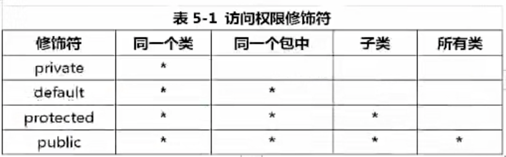
          3. Private 表示私有化，只有类自己可访问。
          4. default表示没有修饰符只有同一个包的类可以访问
          5. protected表示可以被同一个包的类以及其他包中的子类访问
          6. public表示可以被该项目的所有包中的所有类访问。

       6.  关于protected的两个细节:

          1. 若父类和子类在同一个包中，子类可以访问父类的protected成员，也可访问父类对象的protected成员。
          2. 若子类和父类不在同一个包中，子类可以访问父类的protected成员，但是不可以访问父类对象的protected成员。

       7. 封装使用的细节:

          1. 属性使用private访问权限。

          2. 属性私有化之后，提供相对应的get/set方法，来访问相关属性，这一些方法通常是public修饰，已提供对属性的赋值，与读取操作.(需要注意的是:boolean变量的get方法是is开头的)

          3. 一些只用于本类的辅助性方法可以用privat修饰，希望其他的类调用的方法用public修饰。

          4. ```java
             //JavaBean封装演示
             private String name;
                 private int age;
                 private boolean flag;
             
                 public String getName() {
                     return name;
                 }
             
                 public int getAge() {
                     return age;
                 }
                 //boolean类型的值是is开头的
                 public boolean isFlag() {
                     return flag;
                 }
             
                 public void setName(String name) {
                     this.name = name;
                 }
             
                 public void setAge(int age) {
                     this.age = age;
                 }
             
                 public void setFlag(boolean flag) {
                     this.flag = flag;
                 }
             ```

17. 多态:

    1. 多态的概念和实现:

       1. 多态指的是同一个方法调用，由于对象的不同不有不同的行为。

       2. 现实生活中，同一个方法具体实现会完全不同，比如:同样是调用人休息的方法，张三是睡觉，李四是旅游，自己是敲代码，数学教授是做数学题；同样是调用吃饭的方法，中国人用的是筷子，英国人是刀叉，印度人是用手吃饭。

       3. 多态的要点:

          1. 多态是方法的多态，不是属性的多态(多态和属性无关)。
          2. 多态存在的要有3个必要的条件，继承，方法重写，父类指向子类对象。
          3. 父类引用指向之类对象之后，用该父类引用调用子类重写方法，此时多态就出现啦。

       4. ```java
          public class Animal {
          
                  public  void shout(){
                      System.out.println("叫了一声");
                  }
          }
          
          
          class Dog extends Animal{
              public void  shout(){
                  System.out.println("小狗叫");
              }
          }
          
          
          class Brid extends Animal{
              public  void shout(){
                  System.out.println("小鸟叫");
              }
          }
          
          class Pig extends Animal{
              public void shout(){
                  System.out.println("猪叫...");
              }
          }
          
          //调用类
           //定一个静态的方法
              static void animalCry(Animal animal){
                  animal.shout();
              }
              //定义一个普通的方法
              public  void  test_poly_01(Animal animal){
                  animal.shout();
              }
          
          
              public static void main(String[] args) {
                  TestPoly testPoly= new TestPoly();
                  //父类引用 = new 子类对象。
                  Animal a1 = new Dog();//父类引用指向子类对象
                  animalCry(a1);
                  testPoly.test_poly_01(a1);
                  Animal a2 = new Pig();
                  animalCry(a2);
                  testPoly.test_poly_01(a2);
              }
          ```

18. 对象的转型:

    1. 父类引用指向子类对象，我们称之为向上转型，属于自动转型

    2. 向上转型后的父类引用变量只能调用它编译类型的方法，不能调用它运行时类型的方法，这时我们就需要进行类型的强制转换，我们称之为向下转型。

    3. ```java
       public static void main(String[] args) {
       
               Object obj = new String("张三");//向上转型
               //编译器认为obj是Object类型不是String类型，
               //编写程序的时候，如果想调用运行时的方法，只能进行类型的强制转换。
               // 不然通不过编译器的检查
               //obj.charAt(0);//无法调用该类型的方法，
               String str_01 =  (String)obj ; //向下转型
               System.out.println(str_01.charAt(0));//获取制定索引处的字符。
               System.out.println(str_01==obj);//返回的true,表示指向的是同一个引用。
               
           }
       ```

    4. 在向下转型的过程中，必须将引用的变量转成真实子类类型(运行时类型)，否则会出现类型转换异常ClassCastException。

    5. ```java
         Object obj = new String("张三");   
          	StringBuffer stringBuffer = (StringBuffer) obj;
               //会出现类型异常的错误，因为他的真是类型是String 而不是StringBuffer;
               System.out.println(stringBuffer.charAt(0));
       ```

19. 抽象类:

    1. 抽象方法:

       1. 使用abstract修饰的方法，没有方法体，只有声明，定义的是一种规范，就是告诉子类必须要给抽象方法提供具体的实现。

    2. 抽象类:

       1. 包含抽象方法的类就是抽象类，我们通过定义abstract方法定义规范，然后要求子类必须定义具体的实现，通过抽象类，我们就可以做到严格限制子类的设计，使子类之间更加通用。

    3. 要点:

       1. 有抽象方法的类只能被定义为抽象类
       2. 抽象类不能被实例化，即不能使用new来实例化抽象类
       3. 抽象类可以包含属性，方法，构造方法，但是构造方法不能用来new实例,只能被子类调用
       4. 抽象类只能被用来继承
       5. 抽象方法必须被子类实现。

    4. ```java
       //定义一个抽象类
       public abstract class Test_abstract {
           //使用abstract修饰的方法  被称为抽象类
           abstract public void test_001();
       
           abstract public int test_002();
       
           abstract public String test_003();
       }
       
       //继承抽象类
       //继承抽象类的子类，必须实现父类的抽象方法
       public class Test_abstract_01 extends Test_abstract {
       
       
           @Override
           public void test_001() {
               System.out.println("实现了父类的第一个方法...");
           }
       
           @Override
           public int test_002() {
               return 0;
           }
       
           @Override
           public String test_003() {
               return "001";
           }
       }
       ```

20. 接口:

    1. 接口就是规范，定义的是一组规则，体现了现实世界中“如果你是...则必须能..”的思想，如果你是天使，则鼻血可以飞，如果你是汽车，则必须能跑，如果你是好人，则必须能打败坏人，如果你是坏人，则必须进监狱。
    2. 接口的本质是契约，就像我们人一样，制订好规则大家都遵循
    3. 面向对象的精髓，是对对象的抽象，最能体现这一点就是接口。
    4. 接口的作用:
       1. 为啥要做接口，接口和抽象类的区别
       2. 接口就是比抽象类，还要抽象的抽象类，可以更加规范的对子类进行约束，全面专业地实现了:规范和具体的分离。
       3. 抽象类还提供了某一些具体的实现，接口不提供任何的实现，接口中所有方法都是抽象方法，接口是完全面向规范的，规定了一批具有公共方法的规范
       4. 从接口的实现者来看，接口定义了可以向外部提供的服务
       5. 从接口的调用者来看，接口定义定义啦实现者可以提供哪一些服务。
       6. 接口是两个模块之间通信的标准，通信的规范，如果你把你要设计的模块之间的接口定义好，就像相当于完成啦系统的设计大纲，剩下的就是添砖加的具体实现啦，
       7. 接口和实现类不是父子关系，是实现规则额关系，
       8. 
