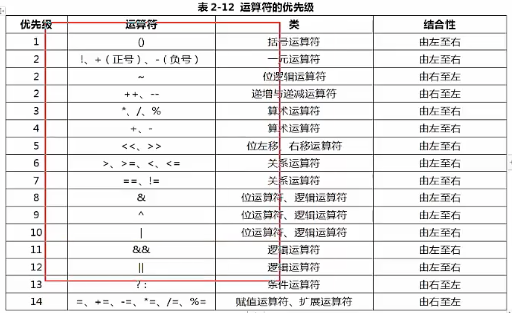

# Java入门及背景

## 计算机语言发展历史以及未来方向

### 计算机已经成为人脑的延伸

1. 计算机已经成为我们这个时代的核心设备，每时每刻都需要它的存在，计算机也不再是大家以前的印象中的台式机，服务器，已经演变成我们身边随处可见的物体。比如：手机，平板电脑，笔记本，以及很多人没有意识到，但实际上设备内部包含的“计算机”的设备，比如电视机，微波炉，汽车，甚至小孩子的智能机器人等等。
2. 可以这么说，计算机已经成为人类身边的延伸，大脑的延伸，成为不可或缺的一部分，未来，计算机将真的进入人的身体，进入大脑，真正成为人体的一部分。比如，在科幻电影中<黑客帝国>中，主角被超级针头插在颈部后方，便能使他快速学习，改变大脑神经网络，几秒成为功夫高手。
3. 算法是计算机的灵魂，编程语言是塑造计算机灵魂的工具。
4. 计算机是如何运作的？对于普通人来说，这很神秘，让计算机拥有灵魂，可以按照人的意志运行，甚至某天按照计算机自己的意志运行。计算机的核心就是算法。算法就是计算机的灵魂，算法的实现由依赖于计算机编程语言。
5. 计算机编程语言的发展，是随这计算机的硬件而发展起来的。硬件速度快，体积小，成本越低，应用到人类社会的场景就越多，那么所需要的的算法就会越复杂，也就要求计算机编程语言越高级。
6. 最初重大几十吨但一秒钟只可以运行5000次的ENIAC(世界上第一台计算机)，只能做非常小的应用。比如某一些情况下，弹道的计算，现在任何一个人的手机运算能力都可以秒杀那个年代地球上所有计算机运算能力的综合。
7. 
8. 
9. 计算机编程语言的发展经历了从低级到高级发展，发展核心思想就是"让人更容易编程"，越容易使用的语言，就有越多的人使用；越多的人使用，就有越多协作;越多协作，就可以创造越复杂的物体；现代社会，一个软件动辄几十人协作，几百人协作，甚至几千人协作也成为可能，这自然为开发复杂的软件提供啦人力基础，这是一个人类普遍的社会现象，越容易使用的工具，通过使用数量，通过大量人协作，彻底改变某个行业甚至整个社会

## 计算机语言经历了三代

 	1. 第一代机器语言:(相当于人类的原始阶段)
 	  	1. 机器语言有数字组成所有的指令，当你使用数字编程，写几百个数字，甚至几千个数字，每天面对纯数字，是非常痛苦的一件事情。
 	  	2. 机器语言通常由数字串组成(最终被简化为0和1)，对于人类而言，机器语言过于繁琐，使用机器语言，人类无法编译出复杂的程序，比如下面一段代码 :
 	       	1. 0000,0000,0000000100000表示LOAD A，16
 	       	2. 0000,0000,00000000000001表示LOAD B 1
 	       	3. 0001,0001,00000010000000表示STORE B 16
 	2. 第二代语言:汇编语言(相当于人类手工阶段)
 	  	1. 为了编程的方便，以及解决更加复杂的问题程序员开始改进机器语言，使用英文缩写的助记符号来表示基本的计算机操作，这一些助记符号构成了汇编语言的基础。如下是常见的汇编语言助记符号:LOAD，MOVE之类，这样人们更容易使用，识别几百几千个单词，感觉要比记忆几百几千个数字，美妙多啦，汇编语言相当于人类社会的手工社会，需要技术非常娴熟的工匠，但是开发效率也非常低下。
 	  	2. 汇编语言虽然可以编写高效率的程序，但是学习和使用都不是易事，并且很难调试，另一个复杂的问题，汇编语言以及早期的计算机语言，没有考虑结构化设计原则，而是使用goto语句来作为程序流程控制的的主要方法，这样做的后果就是：一大段混乱的跳转语句使得程序几乎不可能被读懂，对于那个时代的程序员，能读懂自己上个月写的代码就是一种挑战。
 	  	3. 汇编语言仍然应用于工业电子编程领域，软件加密解密计算机病毒分析等等。
 	3. 第三代语言:高级语言(相当于人类工业阶段):
 		1. 对于简单的任务，汇编语言可以胜任，但是随着计算机的发展，渗透到了工作和生活的更多方面，一些复杂的任务出现啦，汇编语言就显得力不从心啦(应该说是程序员使用汇编语言解决复杂问题出现了瓶颈)。于是出现了高级语言，像我们熟知的C,C++,Java等等都是高级语言
 		2. 高级语言允许程序员使用接近日常英语指令来编写程序，例如我们实现一个简单的额任务A+B=C，使用机器语言，汇编语言，和高级语言的指令如下：
 	4. 
 	5. 从上面这个简单的计算，我们可以得知越到高级语言，越接近于人的思维，人使用起来越方便
 	6. 高级语言的出现，尤其是面向对象基础语言的出现，相当于人类的工业社会，高级语言极其易用，编程门槛和难度大大降低，大量的人员进入到软件开发行业，为软件爆发性增长提供啦充足的人力资源，目前以及可预见的将来，计算机语言仍然处于第三代高级语言阶段。

### 常见编程语言

1. [TIOBE](https://baike.baidu.com/item/TIOBE/2830870)编程语言排行榜是编程语言流行趋势的一个指标，每月更新，这份排行榜排名基于互联网有经验的程序员、课程和第三方厂商的数量。排名使用著名的搜索引擎（诸如Google、MSN、Yahoo!、Wikipedia、YouTube以及Baidu等）进行计算。
2. 
3. c语言:c语言诞生于1972年，可以称为现在高级语言鼻祖，有著名的贝尔实验室发明。C语言是人们追求结构化，模块化，高效率的语言之花。在底层编程语言中，比如嵌入式，病毒开发等应用。可以替代汇编语言来开发系统程序。在高层应用中，也可以开发操作系统(Unix/Linux/windows都是基于C语言开发)到各种应用软件。
4. c++语言:作为C语言的扩展，c++是贝尔实验室在80年代推出的，c++是一种混合语言，既可以实现面向对象编程，也可以开发c语言面向过程风格的程序。c语言让程序员第一次可以通过结构化的理念编写出来易于理解的复杂程序。尽管c语言是一个最伟大的语言，但是程序代码到达3000行以上的话，程序员就不能很好的从总体上把握和控制这个程序，因此在80年代的初期，很多软件项目都面临无法解决的问题而不能顺利进行。1979年，贝尔实验室发明了c++，c++最初的名字是带类的C，后来才改名字叫c++，国内通用的叫法：c加加，国际上通用叫法是c plus plus。C++语言在科学计算，操作系统，网络通信，系统开发，引擎开发仍然被大量使用。
5. Java语言:由美国SUN公司(被oracle公司收购)发明于1995年，是目前业界应用最广发使用人数最多的语言，连续多年排名世界第一，可以称之为“计算机语言届的英语”。Java广泛应用于企业级软件开发，安卓移动开发，大数据云计算等领域，几乎涉及IT所有行业。关于Java的发展历史和特性，将在后面专门介绍。
6. JavaScript语言:JavaScript语言是一种脚本语言，已经被广泛用于web应用开发，应用范围越来越大，重要性越来越高。目前，流行的H5开发的核心其实就是JavaScript语言。
7. Python语言:Python发明于1989年，语法结构简单，易学易懂，Python具有丰富和强大的库，它常被昵称为胶水语言，能够把其他语言制作的各种模块(尤其是C/C++)很轻松的连接在一块，Python广泛应用于：图形处理，科学计算，web编程，多媒体应用，引擎开发，尤其是在未来大热的机器学习和人工智能上有非常大的潜力。
8. PHP语言:PHP原始为personal home page 的缩写，已经正式更名为PHP,PHP语言，一般用于WEB领域，大量的中小型网站以及某一些大型网站使用PHP开发。
9. Object-c和swift:Object-c通常写作Obj-c或者OC，是根据c语言所衍生出来的语言，继承了c语言的特性，是扩充c语言面向对象编程，OC主要用于苹果软件的开发。Swift，苹果于2014年WWDC(苹果开发者大会)发布的新语言，可与OC共同运行于MacOS和IOS平台，用于搭建苹果平台的应用程序。
10. c#语言:c#语言是微软公司发布的面向对象语言，运行于.NET Framework 之上的高级程序语言，C#基于在windows操作系统的应用开发这一领域取代c++，占据主要的地位。成也萧何，败也萧何，C#微软身份，也成了其发展的阻力，在其他的IT领域应用越来越少。
11. kotlin语言:kotlin 是一个用于现代化多平台应用的静态编程语言，有JetBrains开发，Kotlin可以编译成JavaScrpit ，方便在没有JVM的设备上运行。Kotlin语言，已正式成为Android官方支持的开发语言，并且是一种可以兼容Java的语言。
12. Go语言:Go又称Golang语言，是一种开发静态强类型，编译型语言，Go语言语法和C近似，但功能上有:内存安全，GC(垃圾回收)，结构形态，以及CSP-style并发计算。
13. 易语言:易语言是一门是以中文作为程序代码编程语言，其以“易”著称，创始人为吴涛，易语言早期版本的名字为E语言，其最早版本发布可以追述到2000年9月11号
14. Fortran语言:世界上第一种高级语言，IBM公司在1954年提出的，主要用在需要复杂数学计算的科学和工程领域，现在仍然被广泛使用，尤其是在工程领域，Fotran虽然适合编写科学计算方面的程序，但是不适合编写系统程序。
15. Basic语言:虽然容易学但是功能不够强大，应用到大程序的有效性令人质疑，已经逐步推出历史舞台
16. COBOL语言:于1959年提出来，主要用于大量精确处理数据的商业领域，比如金融，银行。但是今天仍然有超过一半的商业软件使用COBOL编写，有将近100万人使用COBOL编程
17. Pascl语言:Pascl的名字是为了纪念十七世纪法国著名哲学家和数学家Blais Pascl而来的，它由瑞士Nikluas Wirth教授于六十年代末设计并创立的，Pascl语言语法严谨，层次分明，程序易写，可读性强，是第一个结构化编程语言，由于没有大厂商和政府支持，只是局限于大学教育这一块。

### Java语言介绍

#### Java语言发展简史

1. 1991年，James Gosling 在sun公司的工程师小组想要设计出这样一种小型计算机语言，该语言主要用于向电视盒这样的消费类电子产品，另外由于不同的厂商选择不同的CPU和操作系统，因此，要求该语言不可以和特定的操作系统绑定在一起，要求语言本身是中立的，也就是跨平台的。所以，这个语言被命名为Green，类似于绿色软件的消息，后来改名字为Oak，橡树的意思，改名后发现已经有一个语言叫这个名字啦，再改名字为Java。

2. 

3. Java语言发展到现在经历了一系列过程:
   1. 1991年，SUN公司的Green项目，Oak。
   2. 1995年，推出Java测试版本
   3. 1996年，推出JDK1.0
   4. 1997年，推出JDK1.1
   5. 1998年，JDK1.2,大大改进啦早期版本缺陷，是一个革命性版本，更名为Java2.0
   6. 2004年，J2SE 5.0(1.5.0) Tiger 老虎
   7. 2006年,J2SE6.0(1.6.0) Mustang 野马
   8. 2011年,JavaSE7.0 Dolphin海豚
   9. 2014年,JavaSE8.0
   10. 2017年,JAVA9.0
   11. 2018年3月,JAVA10
   12. 2018年9月 JAVA11
   13. 2019年3月 JAVA12
   14. 2019年9月 JAVA13
   15. 2020年3月 JAVA14
   
4. Java核心优势:
   1. Java为消费类智能电子产品设计，但智能家电产品并没有像最初那样想象的拥有大的发展。然而90年代，Internet却进入啦爆发式发展阶段，一夜之间，大家都在忙着将自己的计算机连接到网络上，这个时候，遇到一个大的问题，人们发现连接到Internet的计算机各式各样，有IBM，PC，苹果机，各种服务器等等，不仅硬件cpu不一致，操作系统也不一致，整个的网络环境也非常复杂。这个时候，程序员们希望他们编写的程序能够运行在不同的机器上，不同的环境中，这需要一种体系中立的语言(即跨平台)。Java研发小组忽然发现他们用于小范围的语言也可以适应Internet这个大环境。
   2. 跨平台是Java语言的核心优势，赶上最初互联网的发展，并随着互联网的发展而发展，建立了强大的生态体系，目前已经覆盖IT个行业的第一大语言。是计算机界的英语。
   3. 虽然，目前有很多跨平台的语言，但是已经失去先机，无法和Java强大的生态体系抗衡，Java仍将在未来几十年内成为编程语言的主流语言。
   
5. Java各版本的含义:
   1. JavaSE(Java Standard Edition):标准版,定位在个人计算机上的应用
   2. 这个版本是Java平台的核心，它提供啦非常丰富的API来开发一般个人计算机上的应用程序，包括用户界面接口AWT以及Swing，网络功能于国际化，图像处理能力以及输入输出等支持，在上世纪90年代末互联网上大放异彩的Applet也属于这个版本，Applet后来为Flash取代。Flash即将被HTML5取代。
   3. JavaEE(Java Enterprise Edition):企业版本，定位在服务器端的应用
   4. JavaEE是Java SE的扩展，增加了用于服务器开发的类库，如JDBC是让程序员能够直接在Java程序内使用SQL的语法来访问数据库内的数据，Servlet能够延伸服务器的功能，通过请求--响应模式来处理客户端的请求，JSP是一种可以将java程序代码内嵌子啊网页内的技术。
   5. JavaME(Java Micro Edition):微型版本 定位在消费性电子产品应用上
   6. JavaME是JavaSE的内伸,包含J2SE的一部分核心类，也有自己的扩展累，增加了适合微小装置的类库，Javax.microedition.io.*等，该版本针对资源有限的电子消费产品的需求精简核心类库，并提供啦模块化的架构让不同类型产品能够随时增加支持能力。
   7. 
   
6. Java的特性和优势:
   1. 跨平台/可移植性:
      1. 这是Java的核心优势，Java在设计时就非常注重移植性和跨平台性，比如:Java的int永远是32位，不想c++可能时16位，32位，可能根据编译器厂商规定而变化。这样的话程序的移植性就会非常麻烦
   2. 安全性:
      1. Java适合网络/分布式环境，为了达到某个目标，在安全性方面投入了很大的精力，使Java可以很容易构建防病毒，防篡改的系统
   3. 面向对象:
      1. 面向对象是一种程序技术，非常适合大型软件的设计和开发，由于c++为了照顾大量c语言使用者而兼容了c，使得自身仅仅成了带类的c语言，多少影响啦其面向对象的彻底性，Java则是完全的面向对象语言
   4. 简单性:
      1. Java时C++语法的简化版本，我们也称之为c++-，指的就是将c++de一些内容去掉，比如头文件，指针运算，结构，联合，操作符重载，虚基类等等，同时由于语法基于c语言，因此学习起来完全不费力
   5. 高性能:
      1. Java发展之初，总是被人诟病性能低，客观上，高级语言运行效率总是低于低级语言，这个无法避免，Java语言本身发展中通过虚拟机的优化提升啦几十倍运行效率，比如:通过JIT即时编译技术提高运行效率，将一些热点字节码编译成本地机器码，并将结果缓存起来，在需要的时候重新调用，这样的话，使Java程序的执行效率大大提高，某一些代码甚至接近c++效率。
      2. 因此Java低性能的短腿，已经完全被解决啦，业界发展上，我们也看到很多c++应用转到Java开发，很多c++程序员转型为Java程序员。
   6. 分布式:
      1. Java是为Internet的分布式环境设计的，因为它能够处理TCP/IP协议，事实上，提高URL访问一个网络资源和访问本地文件是一样简单，Java还支持远程调用(RMI),使程序能够通过网络调用方法
   7. 多线程:
      1. 多线程的使用可以带来更好的交互响应和实时行为，Java多线程的简单性时Java成为主流服务端开发语言的主要原因之一
   8. 健壮性:
      1. Java是一种健壮的语言，吸收了c/c++语言优点，但去掉了其影响程序健壮性的部分(如指针，内存的申请与释放等)。Java程序不可能造成计算机崩溃，即使Java程序也有可能错误，如果出现某种出乎意料之事，程序也不会崩溃，而是把该异常抛出，在通过异常处理机制加以处理。
   
7.  Java程序运行机制:

   1. 计算机高级语言的类型主要有编译型和解释型两种，而Java语言是两种类型的结合。
   2. Java首先利用文本编辑器编写Java源程序，源文件的后缀名为.java.在利用编译器(Javac)将源程序编译成字节码文件，字节码文件的后缀是.class,最后利用虚拟机(解释器，java)解释执行。
   3. 

8. JVM,JRE,和JDK:

   1. JVM(Java Virtual Machine) 就是一个虚拟的用于执行byte code自己码的虚拟计算机，他也定义啦指令集，寄存器，结构栈，垃圾收集栈，内存区域，JVM负责将Java字节码解释运行，边解释边运行，这样，速度会受到一定的影响。
   2. 不同的操作系统有不同的虚拟机，Java虚拟机机制屏蔽啦底层运行平台的差别，实现了一次编译，随处运行。Java虚拟机是实现跨平台的核心机制，
   3. 
   4. Java Runtime Environment(JRE)包含:Java虚拟机，库函数，运行Java应用程序所必须的文件
   5. Java Development Kit(JDK):包含JRE，以及增加编译器和调试器等应用程序的开发。
   6. JDK，JRE和JVM的关系:

9. Java开发环境搭建:

   1. JDK下载和安装:
   2. [下载地址](https://www.oracle.com/java/technologies/javase-downloads.html)
   3. 
   4. 下载对应的版本，安装的时候和普通软件没有太大的区别的。
   5. 在选择路径的时候，我们采用默认安装。安装完成之后，直接关闭文件
   6. 配置环境变量:

10. 环境变量配置:

    1. 环境变量是在操作系统中一个具有特定名称的对象，它包含了一个或者多个应用程序所将使用到的信息，Path是常见的环境变量，他告诉操作系统，当要求系统运行一个程序而没有告诉它程序所在的完整路径，系统除了在当前目录下寻找此程序，还应到哪一些程序目录下查找。

    2. 设置path环境变量的步骤如下:

       1. 右键计算机----属性----高级系统设置，出现如下界面:
       2. 在弹出的“系统属性”窗口中“高级”标签页下点击“环境变量”按钮
       3. 
       4. 在弹出的“环境变量”窗口中，点击下方的“新建”按钮，在弹出的“新建系统变量”窗口中，新建一个名为“JAVA_HOME”的环境变量，变量值为Java的安装路径.
       5. 
       6. 　4、设置Path环境变量，该变量已经存在，所以在列表中选择Path，点击下方的“编辑”按钮，在弹出的窗口中添加如下信息：%JAVA_HOME%\bin;%JAVA_HOME%\jre\bin，然后点击“确认”按钮即可.
       7. 
       8. 在配置好环境变量后，可以进入cmd中检查Java是否安装正确，检查的命令为 java -version.
       9. 

    3. Java程序需要注意的点:

       1. Java对大小写敏感，如果出现啦大小写拼写错误，程序无法运行

       2. 关键字public 被称为访问修饰符号,用于控制程序的其他的部分，对这段代码的访问级别

       3. 关键字class的意思是类，Java是面向对象的语言，所有代码必须在类里面

       4. 一个源文件最对只可以声明一个public类，其他类的数量不受限制，如果源文件中包含一个public类，源文件名称必须和其中定义的public的类名相同，且以.java为扩展名

       5. 一个源文件可以包含多个类class

       6. 正确编译后的源文件，会得到相应的字节码文件，编译器为每个类生成独立的字节码文件，且字节码文件自动命名为类的名字，且以.class 为扩展名。

       7. main方法是Java应用程序的入口，他有固定的写法:

          1. ```java
             public static void main(String args[]){
             	#代码块
             }
             ```

       8. 在Java中，用花括号划分程序的各个部分，任何方法的代码必须以"{"开头，以"}"结尾，由于编译器忽略空格，所以花括号风格不受限制。

       9. Java中每个语句必须以分号结束，回车不是语句结束的标准，所以一个语句可以跨多行。

# 变量数据类型和运算符号

## 预备知识

### 二进制

1. 二进制，是计算机技术中广泛采用的一种数制，由德国数理哲学家大师莱布尼茨与1679年发明的。二进制数据是由0和1两个数码来表示，他的基数是2 逢二进一，数字计算机只可以识别和处理有0和1组成代码，其运算模式正式二进制。
2. 二进制对应两种状态，广泛应用于电子科学技术，比如:可以对应电子元器件的开光状态，对应信号电压状态，对应卡带是否打孔状态，电磁存储状态等等
3. 二进制广泛应用于我们生活的方方面面，比如:广泛使用的摩尔斯密码，它由两种基本信号组成:短促信号，等等。

### 二进制和十进制的转换

1. 

2. 十进制转换为二进制:

   1. 十进制整数转换为二进制整数采用“除2取余”,逆序排列法
   2. 

3. 二进制转换为十进制:

   1. 二进制转换为十进制采用权相加法
   2. 

4. 注释:

   1. 为了方便程序的阅读，Java语言允许程序员在程序中写上一些说明性文字，用来提高程序的可读性，这些文字性的说明就被称为注释。

   2. 注释不会出现在字节码文件中，即Java编译器编译时会跳过注释语句

   3. 在Java中根据注释的功能不同，主要分为单行注释，多行注释，文档注释。

   4. 单行注释:

      1. 单行注释使用 // 开头，//后面的单行内容均为注释

   5. 多行注释:

      1. 多行注释使用 /* 开头 */结尾，在两个星号之间的内容为注释，我们也可以使用多行注释作为行内注释，但是在使用时需要注意。多行注释不可以嵌套使用。

   6. 文档注释:

      1. 文档注释[/**]和一个星号加上/结尾，注释包含一些特殊说明性的文字以及一些JavaDoc标签.

   7. 示例认识代码中的注释:

   8. ```java
      /**
       * 我是文档注释
       *@ author:我是闫天蓬
       */
      public class Demo_01 {
          public static void main(String[] args) {
              //我是单行注释
              System.out.println("联系单行注释");
              /*
               * 我是多行注释
               */
              System.out.println("练习多行注释");
          }
      }
      
      ```

5. 标识符:

   1. 标识符是用来给变量，类，方法以及包进行命名的，标识符要遵循一定的规则。

   2. 标识符必须是字母，下划线_,美元符号$开头

   3. 标识符号其他部分可以是字母，下划线_,美元符号$ 和数字任意组合

   4. Java标识符大小写敏感，且长度无限制

   5. 标识符不可以是Java的关键字。

   6. 表示类名的每个标识符:每个单词的首字母大写，如Man,GoodMan

   7. 表示方法和变量的标识符:第一个单词大写，从第二个单词开始首字母大写，我们称之为驼峰原则，如eatFood();

   8. Java不采用通常语言的使用的ASCII字符集，而是采用Unicode这样的标准的字符集。因此，这里的字母含义不仅仅包含是英文，还包含汉字等等。但是不建议的大家使用汉字来定义标识符。

   9. ```java
        //标识符命名
              int abc =13;
              int 年龄 =13;
              int $salary = 13;
              int _year = 2020;
              // 下面的是不合法的参数
              //int 123 = "不合法"; 数字不可以作为标识符号开头
      ```

6. 变量:

   1. 如果我们把一个软件，一个程序看成一个大楼的话，变量就是“砖块”，一个个砖块最终堆成了大厦，变量也是进入编程世界最重要的概念，本节从变量的本质开始讲解，让大家一开始就可以抓住变量的核心。

   2. 变量的本质:变量的本质就是代表一个可操作的存储空间，空间的位置是确定的，但是里面放置的是什么值是不确定的，我们可以通过访问变量名来访问“对应的存储空间”，从而操纵这个存储空间存储的值。

   3. Java是一种强类型语言，每个变量都必须声明其数据类型，变量的数据类型决定啦变量的占据存储空间的大小，比如 int a =3;表示变量a的空间大小为4个字节。

   4. 变量作为程序中最基本的存储单元，其要素包含变量名，变量类型和作用域。变量在使用前必须对其声明，只有在声明以后，才能为其分配相应的长度的存储空间。

   5. 变量类似于一个停车场，一个变量类似于一个停车位，我们通过停车位的名字找到对应，位置空间，然后确定上面是什么车，车类似于数据，是可变的。

   6. 变量的声明:

   7. ```java
      type varName  [= value]
      //[]表示的是可选项
      数据类型 变量名  [= 变量值]
       
      // 声明变量 并且赋值
        double salary = 12.3;
      // 声明变量 不赋值
      long earthPopulation;
      int age;
      //不同数据类型的常量会在内存中分配不同的空间
      //每个变量都有类型，类型可以是基本类型，也可以是引用类型
      //变量名必须是合法的标识符号
      //变量声明是一条完整的语句，因此每一个声明都必须是分号结束。
      
      //一行声明多个变量
      int j,i;
      ```

   8. 

   9. 变量分类和作用域:

      1. 从整体上可将变量划分为局部变量和，成员变量，和静态变量

      2. 

      3. ```java
         public class Demo_01 {
         
             int studentNum =1;//成员变量
             static  int Salary =  7800;//静态变量
         
         
             public static void main(String[] args) {
                 //我是单行注释
                 System.out.println("联系单行注释");
                 /*
                  * 我是多行注释
                  */
                 System.out.println("练习多行注释");
         
         
                 //标识符命名
                 int abc =13; //局部变量
                 int 年龄 =13;//局部变量
                 int $salary = 13;//局部变量
                 int _year = 2020;//局部变量
                 // 下面的是不合法的参数
                 //int 123 = "不合法";
             }
         }
         ```

      4. 局部变量:方法或者语句块内部定义的变量，生命周期是从声明位置开始到方法或者语句块执行完毕为止。局部变量在使用前必须先声明，初始化，在使用。

         ```java
          public void test(){
                 int salary = 0;//局部变量
                 int age  = 10; //局部变量
             }
         ```

      5. 成员变量:方法外部，类的内部定义的变量，从属于对象，生命周期伴随着对象始终，如果不自行初始化，他会自动初始化成该类型的默认初始值。

      6. ```java
         public class Test{
         	int i;
         }
         ```

      7. 静态变量(类变量 static variable):使用static 定义，从属于类，生命周期伴随着类加载到卸载，如果不自行初始化，与成员变量相同会自动初始化称该类型的默认初始值。

      10. 常量:

          1. 常量通常是指一个固定的值,例如1,2,3,'a','b',true,false等等。

          2. 在Java语言中，主要是利用关键字final来定义一个常量，常量一旦被初始化后不能再更改其值。

          3. ```java
             //声明格式:
             final type varName = values;
             //声明一个常量PI;
             final double PI=3.14;
             
             public class TestConstans {
             
                 public static void main(String[] args) {
                     //定义一个常量
                     final double PI = 3.14;
                     int r = 2;
                     System.out.println("圆的面积是:"+PI*r*r);
                 }
             }
             ```

      11. 基本数据类型:

          1. Java是一种强类型语言，每个变量必须声明其数据类型，Java的数据类型可分为两大类：基本数据类型和引用数据类型。
          
          2. Java中定义了三类8种数据类型
             1. 数值型:--byte short int long float double
             2. 字符型:char
             3. 布尔类型:---boolean
             
          3. 
          
          4. 整型:
             1. 整型用于表示没有小数部分的数值，他是允许出现负数的，整型的范围与运行Java代码机制的机器无关系，这正是Java程序具有很强的移植性的能力原因之一，于此相反的，c和c++程序需要针对不同的处理器选择最有效的整型。
             2. Java语言整型常量的四种表示形式:
                1. 十进制整数:如99，100
                2. 八进制整数,要求是0开头 如:015
                3. 十六进制整数,要求0x或者0X开头，如0x15
                4. 二进制数,要求0b或合0B开头，如:0b0101;
             3. Java语言的整型常数类型默认是int,声明为long型常量可以后面加L或者l，。
             
          5. 浮点型(主要是小数):
          
             1. 带小数的数据在Java中被称为浮点型,浮点型可分为double和float类型。
          
             2. 
          
             3. float类型又被称为单精度类型，尾数可以精确到7位数有效数字，在很多的情况下，float很难满足精度要求，而double表示这种类型的数值精度大约事float的两倍，又被称为双精度类型，绝大部份程序都是采用double类型。
          
             4. 
          
             5. float:类型的数值又一个后缀f或者F，没有后缀F/f的浮点数默认事double类型，也可以在浮点数后面添加后缀D或者d，已明确其类型位double类型。
          
                ```java
                  float f_01 = 31.4F; //float类型赋值时需要添加后缀F或者f;
                        float f_02 = 3.14f;
                
                        double d1  = 12d; //double 类型赋值时需要添加后缀d或者D;
                        double d2 = 12D;
                ```
          
             6. 浮点型，float和double数据不适合在不允许舍入误差的金融计算领域，如果需要进行不产生舍入误差的精确数字计算，需要使用BigDecimal类。
          
             7. ```java
                 float f_03 = 0.01f;
                        double d3 = 0.1/10;
                        System.out.println(f_03);
                        System.out.println(d3);
                        System.out.println(f_03==d3);  //结果为false 因为两个变量的类型不一致
                        //float和double一般用于做直接比较
                        float f_04 =  233333333333L;
                        float f_05 =  f_04+1;
                        System.out.println(f_04);
                        System.out.println(f_05);
                        System.out.println(f_04==f_05); //f_04等于f_05 返回的是true;
                ```
          
          6. 字符型:
          
             1. 字符类型在内存中占2个字节，在Java中使用单引号来表示字符常量，例如"A"是一个字符，它与‘A’是不同的，“A”表示含有一个字符的字符串。
          
             2. char类型用来表示在Unicode编码表中的字符，Unicode编码被设计用来处理各种语言文字，她占有2个字符，可允许有65536个字符。
          
             3. ```java
                 // 定义char字符
                        char e1 = 'a';
                        char e2 ='中';
                ```
          
             4. Unicode具有从0到65535之间的编码，他们通常从‘\u0000’到‘\uFFFF’,之间的十六进制来表示。
          
             5. ```java
                        // 定义char字符
                        char e1 = 'a';
                        char e2 ='中';
                         
                        char e3 ='\u0078';
                        System.out.println(e3);
                ```
          
             6. 转义字符:Java语言中还允许使用转义字符，‘\’来将后来的字符转变为其他的含义，常用的转义字符及其含义和Unicode值如下表:
          
          7. 布尔类型:boolean类型有两个变量，true和false，在内存中占一个字节或者4个字节，不可以使用0或者非0的整数替代，这点和C语言不同，boolean类型用来判断逻辑运算条件，一般用于程序流程控制。
          
             1. ```java
                boolean flag = true;
                        if (flag){
                            //true分支
                        }else{
                            //false分支
                        }
                ```
          
             2. boolean:类型几个字节说明:在《Java虚拟机规范》一书中描述，虽然定义啦boolean这种数据类型，但是只是对它提供啦非常有限的支持，在Java虚拟机中没有任何提供boolean值专用的字节码指令，Java语言表达式所操作的boolean值，在编译之前都使用Java虚拟机中int数据类型来替代，而boolean数组将会被编码成Java虚拟机的byte数组，每个元素boolean元素占8位，也就是说JVM规范指出boolean当作int处理，也就是4个字节，boolean数组当作byte数组处理，这样我们可以得出boolean类型占了单独使用是4个字节。在数组中确定是1个字节。
          
      10. 运算符:

          1. 计算机最基本用途之一就是执行数学运算，作为一门计算机语言，Java提供啦一套丰富的运算符来操作变量。
          
          2. 算术运算符:
             1. 算术运算符，+ - / * % 属于二元运算符，二元运算符号指的是需要两个操作数才能完成运算的运算符号。其中%是取模运算符，也就是我们常说求余数操作。
             
             2. 二元运算符规则:
             
                1. 整数运算:
             
                   1. 如果两个操作数有一个为long，则结果也是long。
                   2. 没有long时，结果为int，即使操作数权威short，byte，结果也是int，
             
                2. 浮点数运算:
             
                   1. 如果两个操作数有一个时double，则结果为double。
                   2. 只有两个操作数都是float，则结果全部为float。
             
                3. 取模运算:
             
                   1. 其操作数可以作为浮点数，一般使用整数，结果是"余数"，“余数”符号和左边操作数相同。
             
                4. 
             
                   ```java
                   //算术运算
                           int a =3;
                           long b = 4;
                           long c = a+b; //当其中一个为long的则，类型会转换为long类型。
                   
                           byte b_1 = 3;
                           byte b_2 = 4;
                           int b_3 =  b_1+b_2;//两个都是byte的的时候，结构自动转换为int类型
                   
                           //取余数:“余数”符号和左边操作数相同
                           int e = 10%3;
                           System.out.println(e); //结果是1
                           int d =-10%3;
                           System.out.println(d); //结果是-1;
                   
                           int g = 10%-3;
                           System.out.println(g); //结果是1
                   ```
             
             3. 算术运算符++(自增)，--(自减)属于一元运算符，该类操作符只需要一个操作数。
             
                1. ```java
                   //自增和自减
                           int a_01 = 30;
                           a_01++; //相当于a_01 = a_01+1;
                           System.out.println(a_01);
                   
                           int i =10;
                           int h = i++; //i++ 先赋值，在执行自增
                           System.out.println(h);
                   
                           int j = 10;
                           int y = ++j;//++j,先执行自增，在赋值。
                           System.out.println(y);
                   ```
             
          3. 赋值及其扩展赋值运算符:
          
             1. 
          
             2. ```java
                int a  =3;
                        int b =4;
                        a+=b;//相当于 a = a+b;
                        System.out.println(a);
                
                        a-=b;//相当于a = a-b;
                        System.out.println(a);
                
                        a*=b;//相当于 a = a*b;
                        System.out.println(a);
                
                        a/=b;//相当于a = a/b;
                
                        System.out.println(a);
                ```
          
          4. 关系运算符:
          
             1. 关系运算符用来比较运算，关系运算符的结果是布尔值true或者false;
          
             2. 
          
                ```java
                1.=是赋值运算符，而在真正的判断两个操作数是否相等的运算符号是==
                2.== 和!= 是所有(基本和引用)数据类型都可以使用
                3.>,>=,<,<=仅针对数值类型(byte,short,int/long,float ,double以及char)。
                ```
          
             3. ```java
                				int a  = 3;
                        int b = 4;
                   
                        boolean c_01 = a>b;
                        System.out.println(c_01);
                        boolean c_02 = a>=b;
                   
                        System.out.println(c_02);
                   
                        boolean c_03 = a<b;
                        boolean c_04 = a<=b;
                        System.out.println(c_03);
                        System.out.println(c_04);
                        //char和int也是可以比较的
                        char d = 'h';
                        int d_01 =20;
                        System.out.println(d>d_01);
                ```
          
          5. 逻辑运算符:
          
             1. Java中逻辑运算符,逻辑运算符的操作数和运算结果都是boolean的值。
          
             2. 
          
             3. 短路与和短路或 采用短路的方式，从左到右计算，如果只通过运算符左边的操作数就能够确定该逻辑表达式的值，则不会继续计算运算符右边的操作数，提高效率。
          
             4. ```java
                 //整个表达式为false 前面第一个表达式为false 则后面的表达式不在计算。
                       boolean b_01 = 1>2 && 2>(3/0);
                   
                       //会报错，前面的第一个表达式为false，后面的表达式的值会报错，所以整体会报错
                       boolean b_04 = 1>2& 2>(3/0);
             
             
                       boolean b_02 = true;
                       boolean b_03 = false;
                    
                       System.out.println(b_02&b_03);//结果是false 与，有一个是false
                       System.out.println(b_02|b_03);//结果是true; 或 ，有一个是true
                        System.out.println(!b_02);//结果是为true  非 ，去反
                        System.out.println(b_02^b_03);//结果是true 相同是false 不同是true
                ```
          
          6. 位运算符:
          
             1. 位运算指的是进行二进制的运算。
             
             2. 
             
             3. ```java
                int a =7; //二进制是00111
                        int b =8; //二进制是01000
                        //按位与操作& 0&0 =0; 0&1=0;1&0=0 1&1=1
                        //只要有一个是0就是0
                        System.out.println(a&b);//结果是0
                        //按位或运算 | 0|0 =0; 0|1=1;1|0=1;1|1=1;
                        //只要有一个是1就是1;
                        System.out.println(a|b);//结果是15
                        //按位异或^ 0^0=0;0^1=1;1^0=1;1^1=0;
                        //相同为0，不同为1;
                        System.out.println(a^b);//结果是15
                        //取反 ～1=0 ～0=1;
                        //可能会涉及到补码操作。
                        System.out.println(~b);//结果是-9
                
                        //移位运算
                        int c = 5;
                        int d = 40;
                        //相当于5*2*2*2; 左移
                        System.out.println(c<<3);
                        //相当于40/2/2/2  右移
                        System.out.println(d>>3);
                ```
             
          7. 字符串连接符:(+)
          
             1. "+"运算符两侧的操作数只要有一个数字符串(String)类型，系统会自动将另外一个操作数转换为字符串然后在进行连接。
          
             2. ```java
                int a_01 = 12;
                        System.out.println("a="+a_01);//结果是a=12;
                int a="3";
                int b = 4;
                System.out.println(a+b);//结果是34
                ```
          
          8. 条件运算符(三目运算符):
          
             1. ```java
                //语法格式:
                x?y:z;
                其中x为boolean类型表达式，先计算x的值，则整个表达式运算结果为表达式y的值，否则整个运算结果表达式为z的值。
                  			int score = 100;
                        int x =-100;
                        String type = score<60?"不及格":"及格";
                        System.out.println("type="+type);
                        int flag = x>0?1:(x==0?0:-1);
                        System.out.println("flag="+flag);
                ```
          
          9. 运算符优先级:
          
             1. 
          
      11. 数据类型的转换:

          1. 自动类型转换:除了boolean类型的以外的其他七种都是可以做类型转换的，自动类型转换指的是容量小的数据类型可以转换为容量大的数据类型，如图，其中黑色的实线表示无数据丢失的自动类型转换，虚线表示在转换时可能会造成精度损失。

          2. 

          3. 可以将整型常量，直接赋值给byte，short, char等变量类型，而不需要进行强制类型转换，只要不超过其表达的范围即可。

          4. 强制类型转换:强制类型转换，又被称为造型(cast),用于强制的转换一个数值的类型，再有可能丢失信息的情况进行的转换是通过造型来完成的，但可能造成精度降低或者溢出。

          5. ```java
             //语法格式:
             //(type)var 
               //运算符中()中的type表示将值var想要转换成的目标数据类型。
             double a =3.419;
                     int x  = (int)a;//浮点型转换为整数，直接舍弃小数部分
                     System.out.println(x);
             
                     int c  =99;
                     System.out.println((char)c); //转换成char类型
                     //byte 范围是-127到128之间
                     // 300超出范围啦 会转换成一个完全没有关系的值
                     byte b =(byte) 300;
                     System.out.println(b);
             
                     int money = 200000000;//20亿
                     int year = 20;//20年
                     int total = money*year;//超出total是负数，因为超出了int的范围,结果是一个完全不相关的值
                     System.out.println("total = "+total);
                     // 结果默认是int类型，但是超出了int的范围，结果在转换为long类型的话，
                     // 会造成精度丢失。
                     long total1 = money*year;
                     System.out.println("total1="+total1);
                     //先将其中一个数转换为long，整个表达式的值提升，全部使用long来计算。
                     long  totla2 = (long)money* year;
                     System.out.println("total2 ="+totla2);
             ```

      12. 简单的键盘输入和输出:

          ```java
          Scanner scanner = new Scanner(System.in);//获取键盘的操作。
                  System.out.print("请输入您的用户名:");//给出提示
                  String userName = scanner.nextLine();//获取输入的一行，返回的是字符串类型
                  System.out.print("请输入你的薪水:");
                  double salary = scanner.nextDouble();//返回的是double类型的变量
                  System.out.print("请输入你的工作时间:");//返回的是int 类型的变量
                  int year = scanner.nextInt();
          
                  System.out.println("用户名是:"+userName+"你的总工资是:"+(salary*year));
          ```

7. 控制语句:

   1. 流程控制语句用来控制程序中各个语句的执行顺序的语句，可以把语句组合成一定功能的小逻辑代码块。

   2. 顺序结构语句:

      1. 代表先执行a，在执行b的逻辑。先找个女朋友，在结婚，再生孩子

   3. 条件判断语句:

      1. 代表如果...,则...的逻辑，比如，如果看到红灯，就停车，如果女朋友生气了，就买礼物。

   4. 循环结构语句:

      1. 代表如果...,则重复执行...比如:如果女朋友电话没打通，就再打一次。如果没有遇到合适的对象，就再去相亲。

   5. 很神奇的是，三种流程控制语句，就可以表示所有的事情。实际上，任何一种 软件或者程序，小到一个练习，大到一个操作系统，本质上都是有变量，选择语句，循环语句组成的。

   6. 这三种基本逻辑结构是相互支撑的，它们共同构成啦算法的基本结构，无论怎么复杂的逻辑结构，都可以通过他们来表达。上述两种结构组成的程序可以解决全部的问题，所以任何一种高级语言具备以上两种结构。

   7. 条件判断:

      1. 选择结构用于判断给定的条件，然后根据判断的结果来控制程序的流程，主要的条件判断结构有:if结构和siwtch结构，而if结构有分为，if单分支结构，if-else双分支结构，if-else-if-else多分支结构

      2. 单分支结构:

         1. ```java
            语法结构:
            if (布尔表达式){
            			语句块
            }
            ```

         2. if语句对布尔表达式进行判定，若判断为真，则执行{}中代码块，否则跳过该语句块。

         3. ```java
            // double d_01 = Math.random();//生成0到1到随机数，包含0但是不包含1
                    // System.out.println(d_01);
                    //生成一个0到6之间的随机数
                    int a = 1+(int)(Math.random()*6);
                    int b = 1+(int)(Math.random()*6);
                    int c = 1+(int)(Math.random()*6);
            
                    int count =a+b+c;
                    if (count>=15){
                        System.out.println("手气不错，接着玩");
                    }
                    if(count>=10&& count<15){
                        System.out.println("手气还可以");
                    }
                    if(count<10){
                        System.out.println("手气太差了，去洗洗手");
                    }
                    System.out.println("第一次骰子得分是："+a+",第二次骰子是:"+b+",第三次骰子是:"+c);
                    System.out.println("当前得分是："+count);
            
            //if语句可以省略{}，但是作用域只对第一句有效，但是一般不建议这么使用。
            ```

      3. 双分支结构:(if-else)结构

         1. ```java
            //语法结构:
            if(布尔表达式){
            	语句块1
            }else{
            	语句块2
            }
            当布尔表达式为真的时候，执行语句块1，否则执行else部分也就是语句块2。
            ```

         2. 

         3. ```java
            //随机生成一个0到4区间的半径，并根据半径求圆的周长和面积。
                    double r =  4*Math.random();//生成0到4之间的随机数
                    double area = Math.PI*r*r;//面积
                    double circle = 2*r*Math.PI;//周长
                    System.out.println("当前的半径是:"+r);
                    if(area>=circle){
                        System.out.println("当前的面积是:"+area+",当前的周长是:"+circle+",面积大于等于周长");
                    }else{
                        System.out.println("当前的面积是："+area+",当前的周长是:"+circle+",面积小于周长");
                    }
            ```

         4. 

